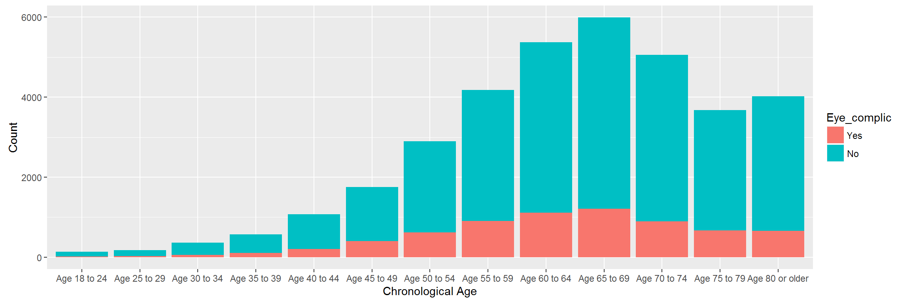

### My course project in the Introduction to Probability and Data Course in Coursera

This repository contains my course project submitted through GitHub for the course Introduction to Probability and Data in Coursera. Introduction to Probability and Data is course 1 of 5 in the [Statistics with R Specialization]("https://www.coursera.org/specializations/statistics").

### Course Description

**About this course:** This course introduces you to sampling and exploring data, as well as basic probability theory and Bayes' rule. You will examine various types of sampling methods, and discuss how such methods can impact the scope of inference. A variety of exploratory data analysis techniques will be covered, including numeric summary statistics and basic data visualization. You will be guided through installing and using R and RStudio (free statistical software), and will use this software for lab exercises and a final project. The concepts and techniques in this course will serve as building blocks for the inference and modeling courses in the Specialization. 

### Course project

The course project for this course will require the learner to identify a research question and use the Behavioral Risk Factor Surveillance System ([BRFSS]("http://www.cdc.gov/brfss/")) dataset to answer the reserch question. The project is designed to help you discover and explore research questions of your own, using real data and statistical methods we learn in this class. The the project will be graded via peer assessments, meaning that you will need to evaluate three peers' projects after submitting your own.

### Research questions

Research quesion 1
: Is there an association between being diagnosed with a stroke and body mass index among responders who were told they were diabetics?

Research quesion 2
: Is there an association between being diagnosed with heart attack and Body Mass Index among responders who were told they were diabetics?

Research quesion 3
: Is there an association between chronological age and being told that diabetes has affected the eyes among responders who were told they were diabetics?

### Sample Plots

### Content 

This Repo contains the following:

- index1.png 
- intro_data_prob_project.html 
- intro_data_prob_project.md 
- intro_data_prob_project_files
- A ReadMe markdown document

The README markdown document is displayed by default by GitHub whenever you visit a GitHub repository. The document you are reading now is the README.md file. It contains information about the content of this repo.

The README.html document is the html version of the README.md document.

The index1.png file is image of the plot that is displayed.

The intro_data_prob_project.md is a markdown document which contains my project for this course. You can view the file by clicking on it.

The intro_data_prob_project.html document is the html version of the intro_data_prob_project.md markdown document. You can view the file by clicking on this link [my project in Introduction to Probability and Data](https://htmlpreview.github.io/?https://github.com/DocOfi/Statistics-with-R/Course1/intro_data_prob_project.html).

The intro_data_prob_project_files contain the images that are displayed in the markdown and html versions of my project

To download the content of this repository as a .zip file, click on the Download ZIP button. If you have a GitHub account, you can fork the content so you'll have a copy on your GitHub account.  

