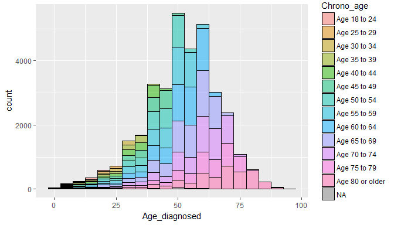

## Setup

### Load packages


```r
library(ggplot2)
library(dplyr)
library(statsr)
```

### Load data

The Behavioral Risk Factor Surveillance System (BRFSS) is a collaborative project between all of the states in the United States (US) and participating US territories and the Centers for Disease Control and Prevention (CDC). BRFSS is an ongoing surveillance system designed to measure behavioral risk factors for the non-institutionalized adult population (18 years of age and older) residing in the US.  

For the 2013 survey, BRFSS collected data through landline telephone- and cellular telephone-based surveys using a simple random-sample design in some states or a disproportionate sample design for most states. For landline telephone sampling BRFSS divided the telephone numbers into high and medium density strata and sampled them seperately. For the cellular telephones they start with a single stratum but tried to target smaller geographically defined populations.

The data for the 2013 survey was downloaded from their website at http://www.cdc.gov/brfss/.  Details about the questionaire they used can be found at http://www.cdc.gov/brfss/questionnaires/pdf-ques/2013%20BRFSS_English.pdf. Details about the variables in the dataset can be found at http://www.cdc.gov/brfss/annual_data/2013/pdf/CODEBOOK13_LLCP.pdf


```r
load("brfss2013.RData")
```

We find that the 2013 survey data consist of 491775 rows and 330 column variables. 

## Part 1: Data

We will limit our analysis to diabetes and diabetes-related variables in this analysis. We provide a desciption of the variables we used in a table below. We will examine the relationships of some of the variables included  in our subset of the 2013 BRFSS data. 

When examining our data for possible associations among our chosen variables, we must be mindful that random allocation was not performed. The responders to the survey self-selected into the different categories based on the presence of certain conditions.  Causality therefore cannot be inferred in this situation as the conditions present does not afford an experimental design that create equal conditions for a control group and an experimental group. 

Furthermore, there is no time frame available from the survey to determine if a condition occurred prior to another condition. Whether a condition is the cause or effect of another condition is impossible to determine. To infer a causal relationship, certain criteria has to be present like: strength of association, temporality as mentioned earlier, biologic gradient, biological plausability, an experimental evidence like a randomized controlled trial, and consistency of findings in several studies (Bradford-Hill, 1965, Rothman, 1998, Hofler, 2005).

Although great efforts were made in order to sample the population randomly, the results of the survey cannot be generalized to the general population for two reasons.  First, there is a substantial portion of the population who do not own a cellular or a landline telephone even though, the [American Community Survey](http://factfinder2.census.gov/faces/tableservices/jsf/pages/productview.xhtml?src=bkmk) estimates that 97.5% of households had a telephone service in 2012. Not owning a telephone or a cellular phone is probably related to socio-economicone status.  BRFSS is a survey pertaining to health.  Those who are economically deprived are usually the ones who have more health problems as evidenced by a social gradient that exist in health and health behaviours and studies based on health inequalities (Marmot, 1996). Second, the response rates for the landline telephone survey was only 49.6% while the cellular telephone survey was 37%. 

A telephone survey has certain biases that is inherent in its design. The first reason described above maybe termed a selection bias while the second is a positive responder bias, where only those who are willing to participate are included in data collecton.  Furthermore, information obtained maybe inaccurate due to poor recall or the subject in some way provided answers that are meant to impress the interviewer or the opposite.  Nevertheless, a telephone survey design affords a very economical and time-saving strategy that facilitate collecting data from a large population. 


## Brief Desription of Variables in our subset data frame
#### Table 1. selected variables

|Variable         |Question                                                                                 |DataType |
|:----------------|:----------------------------------------------------------------------------------------|:--------|
|`state`          |State Fips Code                                                                          |Factor   |
|`ageg5yr`        |Reported Age In Five-Year Age Categories Calculated Variable                      |Factor   |
|`diabete3`       |(Ever Told) You Have Diabetes                                                            |Factor   |
|`cvdinfr4`       |Ever Diagnosed With Heart Attack                                                         |Factor   |
|`cvdstrk3`       |Ever Diagnosed With A Stroke                                                             |Factor   |
|`chkhemo3`       |Times Checked For Glycosylated Hemoglobin                                                |int      |
|`doctdiab`       |Times Seen Health Professional For Diabetes                                              |Factor   |
|`diabeye`        |Ever Told Diabetes Has Affected Eyes                                                     |Factor   |
|`diabedu`        |Ever Taken Class In Managing Diabetes                                                    |Factor      |
|`bmi5cat`        |Computed Body Mass Index Categories                                                      |Factor   |
|`smoker3`        |Computed Smoking Status                                                                  |Factor   |


```r
mydata <- brfss2013 %>% select(X_state, X_ageg5yr, diabete3, cvdinfr4, cvdstrk3, diabage2, chkhemo3, doctdiab, diabeye, diabedu, X_bmi5cat, X_smoker3)
names(mydata) <- c("State", "Chrono_age", "Told_diab", "Diag_MI", "Diag_CVA", "Age_diagnosed", "Hba1c_monitor", "Visit_HCprof", "Eye_complic", "Diab_educ", "BMI", "Smoking_stat")
```

we changed the name of some of the variables in order to make them more intuitive.  we examine our data a little bit so we can formulate several good research questions.

#### Table 2. comparing the number of diabetic and non-diabetics in our sample


```r
mydata %>% group_by(Told_diab) %>% tally() %>% mutate(percent = (n/sum(n))*100) %>% mutate(percent = round(percent,2)) %>% arrange(desc(percent))
```

```
## # A tibble: 5 x 3
##                                    Told_diab      n percent
##                                       <fctr>  <int>   <dbl>
## 1                                         No 415374   84.46
## 2                                        Yes  62363   12.68
## 3    No, pre-diabetes or borderline diabetes   8604    1.75
## 4 Yes, but female told only during pregnancy   4602    0.94
## 5                                       <NA>    832    0.17
```

About 12.7% of the people surveyed said, they were they told that they were diabetic previously compared to 84.4% who recalled they were never told they were diabetic.  Almost 1% were told they were diabetic during a pregnancy(gestational diabetes).

#### Table 3. comparing the number of diabetics in the different categories of BMI


```r
mydata %>% filter(Told_diab == "Yes") %>% group_by(BMI) %>% tally() %>% mutate(percent = (n/sum(n))*100) %>% mutate(percent = round(percent,2)) %>% arrange(desc(percent))
```

```
## # A tibble: 5 x 3
##             BMI     n percent
##          <fctr> <int>   <dbl>
## 1         Obese 31146   49.94
## 2    Overweight 18788   30.13
## 3 Normal weight  8622   13.83
## 4          <NA>  3392    5.44
## 5   Underweight   415    0.67
```

50% of the responders who were told they were diabetic were obese, while 30% were overweight.  Only 13.8%  were of normal weight and less than 1 5 was underweight. BMI is computed by dividing the weight in kilograms by the height in meters.  Based on the result a responder is categorized as obese, overweight, normal weight or underweight.

#### Table 4. categories of BMI

|Category         |BMI score                                                                               
|:----------------|:----------------------------------------------|
|`Obese`          |30.00 <= computed BMI < 99.99)                 |
|`overweight`     |25.00 <= computed BMI < 30.00                  |
|`normal weight`  |18.50 <= computed BMI < 25.00                  |
|`underweight`    |BMI < 18.50                                    |

#### Table 5 comparing the number of diabetics in the different categories of Smoking Status


```r
mydata %>% filter(Told_diab == "Yes") %>% group_by(Smoking_stat) %>% tally() %>% arrange(desc(n)) %>% mutate(percent = (n/sum(n))*100) %>% mutate(percent = round(percent,2)) %>% arrange(desc(percent))
```

```
## # A tibble: 5 x 3
##                            Smoking_stat     n percent
##                                  <fctr> <int>   <dbl>
## 1                          Never smoked 29361   47.08
## 2                         Former smoker 22712   36.42
## 3 Current smoker - now smokes every day  6146    9.86
## 4 Current smoker - now smokes some days  2390    3.83
## 5                                  <NA>  1754    2.81
```

47% of the responders who were told they were diabetic never smoked and 36% were former smokers.  About 14% were current smokers.

#### Figure 1. plot comparing the number of diabetics in the different Age Groups


```r
age_df <- mydata %>% filter(Told_diab == "Yes") %>% select(Age_diagnosed, Chrono_age)
age_df$Age_diagnosed <- as.numeric(as.character(age_df$Age_diagnosed))
ggplot(age_df, aes(x = Age_diagnosed, fill = Chrono_age)) + geom_histogram(alpha = 0.5, binwidth = 5, colour = "black")
```

<!-- -->

Most of the patients who were told they were diabetics were diagnosed between the ages of 45 and 60. The colors in the bins indicate the patients current age.  We see pink colors in the bins along the age of 40 indicating that Some of the patients who are currently above the age of 70 have been told they were diabetics when they were in their 40's.

#### Table 6. comparing the number of diabetics in the different States


```r
mydata %>% filter(Told_diab == "Yes") %>% group_by(State) %>% tally() %>% arrange(desc(n))
```

```
## # A tibble: 54 x 2
##             State     n
##            <fctr> <int>
##  1        Florida  5122
##  2         Kansas  2832
##  3       Nebraska  2009
##  4 South Carolina  1802
##  5  Massachusetts  1762
##  6       Maryland  1698
##  7           Ohio  1673
##  8       Michigan  1630
##  9       Kentucky  1625
## 10          Texas  1534
## # ... with 44 more rows
```

Table 6 above show the top ten states that had the most number of responders who were told they weere diabetics. Florida was number 1.

## Part 2: Research questions

**Research quesion 1:** Is there an association between being diagnosed with a stroke and body mass index among responders who were told they were diabetics?

This question is of interest to me because of the increasing number of people affected with diabetes and diabetes complications each year. Body mass index has been identified as one of the risk factors for diabetes complications such as stroke.

**Research quesion 2:** Is there an association between being diagnosed with heart attack and Body Mass Index among responders who were told they were diabetics?

This question is of interest to me because I wanted to compare whether there is a stronger association between body mass index and heart attack among diabetics compared  to an association between body mass index and stroke.

**Research quesion 3:** Is there an association between chronological age and being told that diabetes has affected the eyes among responders who were told they were diabetics?

This question is of interest to me because diabetes retinopathy is a leading cause of blindness among the elderly diabetic population

## Part 3: Exploratory data analysis

**Research quesion 1:** Is there an association between being diagnosed with a stroke and body mass index among responders who were told they were diabetics?

#### Table 7. comparing the number of diabetics who had a stroke in the different BMI groups


```r
mydata %>% filter(Told_diab == "Yes", BMI != "NA", Diag_CVA != "NA") %>% group_by(Diag_CVA, BMI) %>% tally() %>% filter(Diag_CVA == "Yes") %>% arrange(desc(n))
```

```
## # A tibble: 4 x 3
## # Groups:   Diag_CVA [1]
##   Diag_CVA           BMI     n
##     <fctr>        <fctr> <int>
## 1      Yes         Obese  2962
## 2      Yes    Overweight  1978
## 3      Yes Normal weight  1025
## 4      Yes   Underweight    56
```

Table 7 above suggests that there is an association between increasing BMI and being diagnosed with a stroke among responders who were told they were diabetics.  However, the number of responders who were told they were diabetics also increased with increasing BMI as shown in the plot below. It is difficult to determine whether the increase in number of strokes among diabetics is associated with increasing BMI or simply because there were more diabetics who were obese and overweight in our sample.

The unequal allocation of patients to the different categories of BMI makes it difficult to imply an association much less imply a causal relationship between BMI and stroke.

#### Figure 2. plot comparing the number of diabetics in the different BMI Groups who had a stroke


```r
mydata %>% filter(Told_diab == "Yes"|Told_diab == "No", BMI != "NA", Diag_CVA != "NA") %>% group_by(Diag_CVA, BMI,Told_diab) %>% tally() %>% ggplot(aes(x = BMI, y = n, fill = Diag_CVA)) + geom_bar(stat = "identity") + labs(x = "Body Mass Index", y = "Count") + facet_wrap( ~ Told_diab)
```

<!-- -->

**Research quesion 2:** Is there an association between being diagnosed with heart attack and Body Mass Index among responders who were told they were diabetics?

#### Table 8. comparing the number of diabetics who had a heart attack in the different BMI groups


```r
mydata %>% filter(Told_diab == "Yes", BMI != "NA", Diag_MI != "NA") %>% group_by(Diag_MI, BMI) %>% tally() %>% filter(Diag_MI == "Yes") %>% arrange(desc(n))
```

```
## # A tibble: 4 x 3
## # Groups:   Diag_MI [1]
##   Diag_MI           BMI     n
##    <fctr>        <fctr> <int>
## 1     Yes         Obese  4759
## 2     Yes    Overweight  3110
## 3     Yes Normal weight  1384
## 4     Yes   Underweight    74
```

Table 8 above suggests that there is an association between increasing BMI and being diagnosed with heart attack among responders who were told they were diabetics.  However, the number of responders who were told they were diabetics also increased with increasing BMI as shown in the plot below. It is difficult to determine whether the increase in number of heart attack among diabetics is associated with increasing BMI or simply because there were more diabetics who were obese and overweight in our sample.

The unequal allocation of patients to the different categories of BMI makes it difficult to imply an association much less imply a causal relationship between BMI and heart attack.

#### Figure 3. plot comparing the number of diabetics in the different BMI Groups who had a heart attack


```r
mydata %>% filter(Told_diab == "Yes"|Told_diab == "No", BMI != "NA", Diag_MI != "NA") %>% group_by(Diag_MI, BMI,Told_diab) %>% tally() %>% ggplot(aes(x = BMI, y = n, fill = Diag_MI)) + geom_bar(stat = "identity") + labs(x = "Body Mass Index", y = "Count") + facet_wrap( ~ Told_diab)
```

<!-- -->


**Research quesion 3:** Is there an association between chronological age and being told that diabetes has affected the eyes among responders who were told they were diabetics?

#### Table 9. comparing the number of diabetics who had eye problems in the different age groups


```r
mydata %>% filter(Chrono_age != "NA", Eye_complic != "NA", Diag_MI != "NA") %>% group_by(Eye_complic, Chrono_age) %>% tally() %>% slice()
```

```
## # A tibble: 26 x 3
## # Groups:   Eye_complic [?]
##    Eye_complic   Chrono_age     n
##         <fctr>       <fctr> <int>
##  1         Yes Age 18 to 24    22
##  2         Yes Age 25 to 29    30
##  3         Yes Age 30 to 34    57
##  4         Yes Age 35 to 39   111
##  5         Yes Age 40 to 44   207
##  6         Yes Age 45 to 49   402
##  7         Yes Age 50 to 54   623
##  8         Yes Age 55 to 59   905
##  9         Yes Age 60 to 64  1113
## 10         Yes Age 65 to 69  1213
## # ... with 16 more rows
```

Table 9 above suggests that there is an association between increasing age and being told that diabetes has affected the eyes among those who were told they were diabetics.  However, the number of responders who were told they were diabetics also increased with increasing age as shown in the plot below. It is difficult to determine whether the increase in number of eye problems among those told they were diabetics is associated with increasing age or simply because there were more responders who were told they were diabetics in the older age groups.

The unequal allocation of patients to the different age groups makes it difficult to imply an association much less imply a causal relationship between increasing age and eye problems among those told they were diabetics.

#### Figure 4. plot comparing the number of diabetics in the different age Groups who had eye problems


```r
mydata %>% filter(Chrono_age != "NA", Eye_complic != "NA", Diag_MI != "NA") %>% group_by(Eye_complic, Chrono_age, Diag_MI) %>% tally() %>% ggplot(aes(x = Chrono_age, y = n, fill = Eye_complic)) + geom_bar(stat = "identity") + labs(x = "Chronological Age", y = "Count")
```

<!-- -->

## References

1. [BRFSS web site](http://www.cdc.gov/brfss/)
2. [BRFSS Questionnaire (Mandatory and Optional Modules)](http://www.cdc.gov/brfss/questionnaires/pdf-ques/2013%20BRFSS_English.pdf)
3. [BRFSS Codebook](http://www.cdc.gov/brfss/annual_data/2013/pdf/CODEBOOK13_LLCP.pdf)
4. [BRFSS Guide to Calculated Variables](http://www.cdc.gov/brfss/annual_data/2013/pdf/2013_Calculated_Variables_Version15.pdf)
5. [BRFSS Guide to Optional Modules Used, by State](http://apps.nccd.cdc.gov/BRFSSModules/ModByState.asp?Yr=2013)
6. [BRFSS Overview](http://www.cdc.gov/brfss/annual_data/2013/pdf/Overview_2013.pdf)
7. Hill AB. The environment and disease: association or causation? Proc R Soc Med 1965;58:295-300.
8. Rothman KJ, Greenland S. Modern epidemiology. 2nd ed. Philadelphia: Lippincott-Raven; 1998. 
9. Höfler M. The Bradford Hill considerations on causality: a counter-factual perspective. Emerg Themes Epidemiol 2005;2:11
8. Marmot M. The social pattern of health and disease. In: Blane D, Brunner E, Wilkinson R, editors. Health and social organization: towards a health policy for the 21st century. London: Routledge; 1996. p. 42-67.


```r
sessionInfo()
```

```
## R version 3.4.1 (2017-06-30)
## Platform: x86_64-w64-mingw32/x64 (64-bit)
## Running under: Windows 7 x64 (build 7600)
## 
## Matrix products: default
## 
## locale:
## [1] LC_COLLATE=English_United States.1252 
## [2] LC_CTYPE=English_United States.1252   
## [3] LC_MONETARY=English_United States.1252
## [4] LC_NUMERIC=C                          
## [5] LC_TIME=English_United States.1252    
## 
## attached base packages:
## [1] stats     graphics  grDevices utils     datasets  methods   base     
## 
## other attached packages:
## [1] bindrcpp_0.2  statsr_0.0.1  dplyr_0.7.4   ggplot2_2.2.1
## 
## loaded via a namespace (and not attached):
##  [1] Rcpp_0.12.14     bindr_0.1        knitr_1.17       magrittr_1.5    
##  [5] munsell_0.4.3    xtable_1.8-2     colorspace_1.3-2 R6_2.2.2        
##  [9] rlang_0.1.4.9000 stringr_1.2.0    plyr_1.8.4       tools_3.4.1     
## [13] grid_3.4.1       gtable_0.2.0     htmltools_0.3.6  yaml_2.1.14     
## [17] lazyeval_0.2.1   rprojroot_1.3-1  digest_0.6.13    assertthat_0.2.0
## [21] tibble_1.3.4     shiny_1.0.5      mime_0.5         glue_1.2.0      
## [25] evaluate_0.10.1  rmarkdown_1.8    labeling_0.3     stringi_1.1.6   
## [29] compiler_3.4.1   scales_0.5.0     backports_1.1.1  httpuv_1.3.5    
## [33] pkgconfig_2.0.1
```
