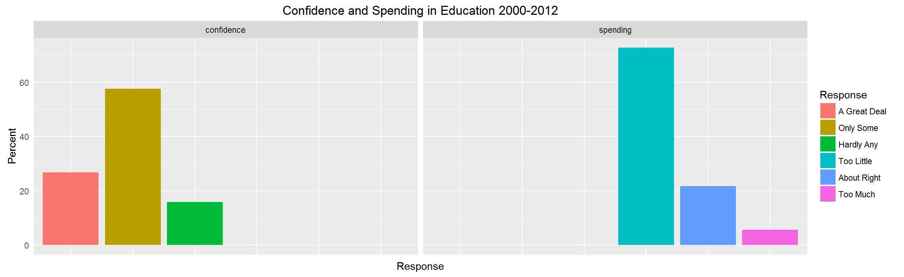
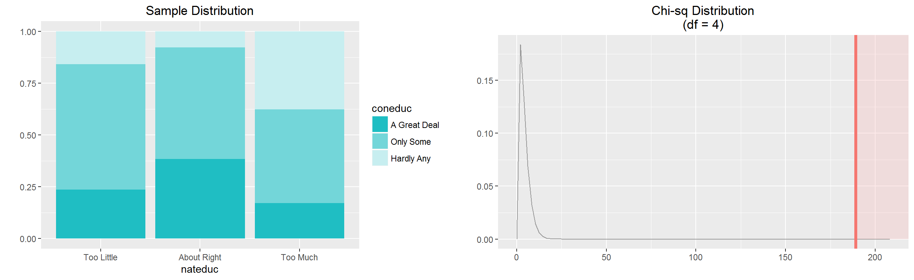

### My course project in the Introduction to Inferential Statistics Course in Coursera

This repository contains my course project submitted through GitHub for the course Introduction to Inferential Statistics in Coursera. Introduction to Inferential Statistics is course 2 of 5 in the [Statistics with R Specialization]("https://www.coursera.org/specializations/statistics").

### Course Description

**About this course:** This course covers commonly used statistical inference methods for numerical and categorical data. You will learn how to set up and perform hypothesis tests, interpret p-values, and report the results of your analysis in a way that is interpretable for clients or the public. Using numerous data examples, you will learn to report estimates of quantities in a way that expresses the uncertainty of the quantity of interest. You will be guided through installing and using R and RStudio (free statistical software), and will use this software for lab exercises and a final project. The course introduces practical tools for performing data analysis and explores the fundamental concepts necessary to interpret and report results for both categorical and numerical data  - *from* https://www.coursera.org/learn/inferential-statistics-intro/

### Course Project

The course project for this course will require the learner to identify a research question and use the General Social Survey [GSS](" http://gss.norc.org/") dataset to answer the research question. The project is designed to help you discover and explore research questions of your own, using real data and statistical methods we learn in this class. The the project will be graded via peer assessments, meaning that you will need to evaluate three peers' projects after submitting your own.

### Research questions

Research quesion 1
: Is confidence in educational institutions associated with opinions regarding Government spending for education?

Research quesion 2
: Can the difference in opinions regarding spending for education among those with hardly any confidence in educational institutions be explained by differences in income? Can low or high average income influence the respondents to believe that too much is spent for education?

Research quesion 3
: Women tend to do better in school. Could gender be associated with belief regarding Government spending for education?

### Sample Plots

### Content 

This Repo contains the following:

- A ReadMe markdown document
- index1.png 
- improvedProj.html 
- improvedProj_files
- index1.png
- index2.png

The README markdown document is displayed by default by GitHub whenever you visit a GitHub repository. The document you are reading now is the README.md file. It contains information about the content of this repo.

The improvedProj.html document contains contains my project for this course. You can view the file by clicking on this link [my project in Inferential Stitics](https://htmlpreview.github.io/?https://github.com/DocOfi/Statistics-with-R/Course2/improvedProj.html).

The improvedProj_files folder contains the images displayed in the improvedProj.html document.

The index1.png and index2.png files are images of plots that are displayed in the README markdown document.

