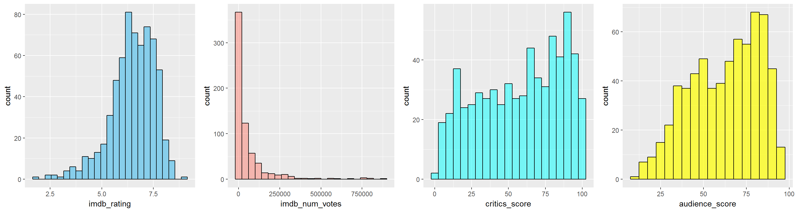
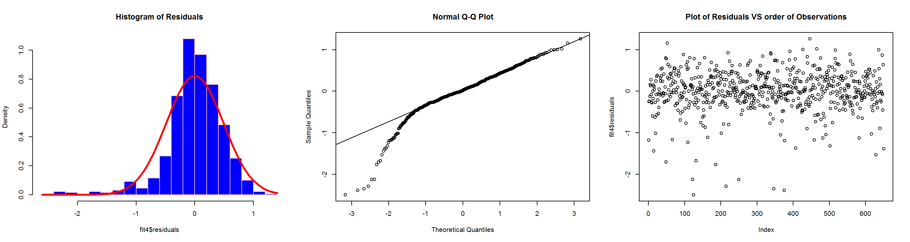

# Linear Regression and Modeling
### My course project in the Linear Regression and Modeling Course in Coursera

#### Course Description

This repository contains my course project submitted through GitHub for the course Linear Regression and Modeling in Coursera. Linear Regression and Modeling is course 3 of 5 in the [Statistics with R Specialization]("https://www.coursera.org/specializations/statistics"). 

This course introduces the learner to sampling and exploring data, as well as basic probability theory. The learner will examine various types of sampling methods and discuss how such methods can impact the utility of a data analysis. The concepts in this module will serve as building blocks for our later courses.

# Introduction

For this course the learner will develop a multiple linear regression model that will explain what makes movies popular given the variables in a dataset provided

The data provided comes from a random sample of movies which includes information from [Rotten Tomatoes]("http://www.rottentomatoes.com/") and  Internet Movie Database [IMDB]("http://www.imdb.com/").

### Content 

This Repo contains the following:

- index1.png 
- index2.png
- movies.html 
- movies.md 
- movies_files
- A ReadMe markdown document

The README markdown document is displayed by default by GitHub whenever you visit a GitHub repository. The document you are reading now is the README.md file. It contains information about the content of this repo.

The .png files are the images of the plots that are displayed.

The movies.md is a markdown document which contains my project for this course. You can view the file by clicking on it.

The movies.html document is the html version of the movies.md markdown document. You can view the file by clicking on this link [my project in Linear Regression and Modeling](https://htmlpreview.github.io/?https://github.com/DocOfi/Statistics-with-R/Course5/movies.html).

The movies_files folder contains other images that are displayed in the movies.md and movies.html documents.

To download the content of this repository as a .zip file, click on the Download ZIP button. If you have a GitHub account, you can fork the content so you'll have a copy on your GitHub account.  

3