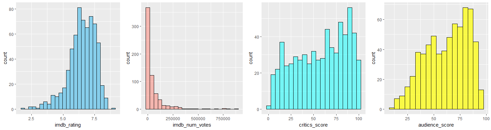
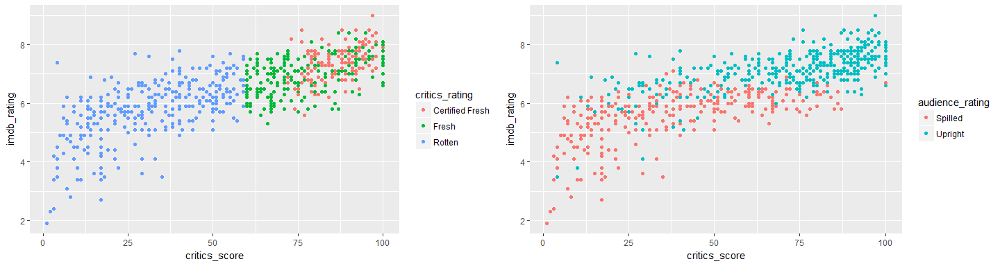
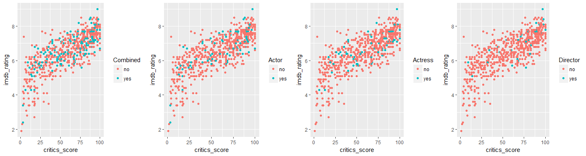
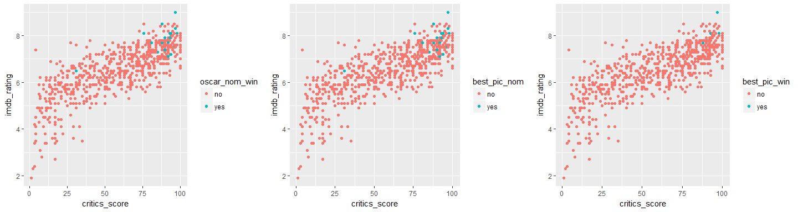
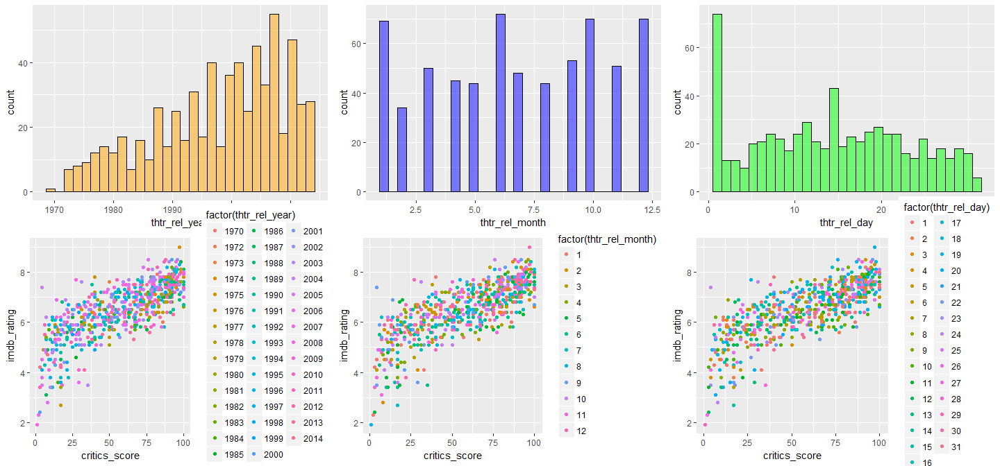
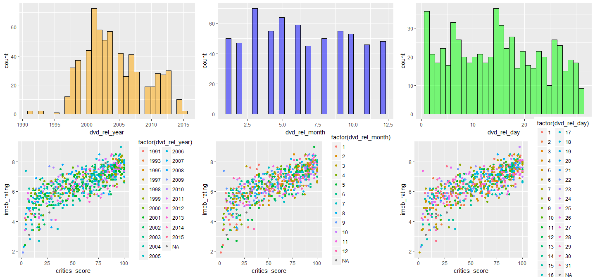
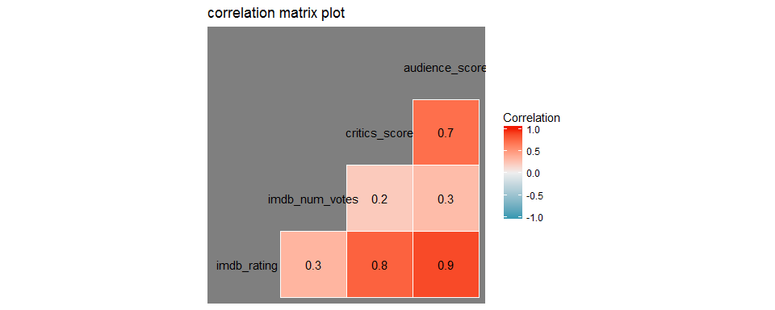
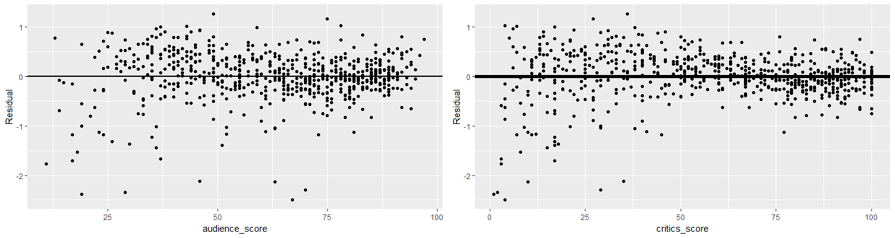
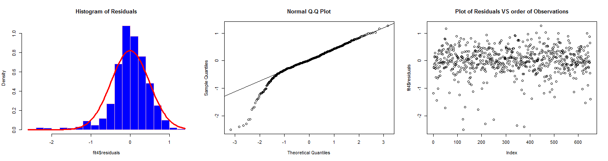
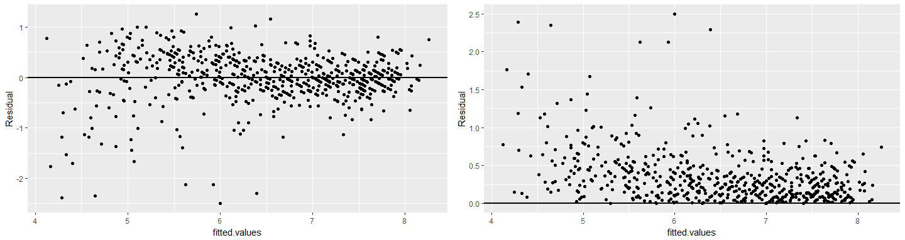

## Setup

<div id="instructions">
Our purpose for this exercise is to develop a multiple linear regression model that will explain what makes movies popular given the variables in a dataset provided for the Linear Regression and Modelling course offered by the Duke University in Coursera.  The dataset contains information from [Rotten Tomatoes](http://www.rottentomatoes.com), a website that keeps track of all reviews for each films and aggregates the results and Internet Movie Database [IMDB](http://www.imdb.com), an online database of information related to film, television programs and video games. We will also use the model to predict on a movie released in 2016 that is not included in the dataset.</div>

### Load packages


```r
library(ggplot2)
library(dplyr)
library(caret)
library(statsr)
library(gridExtra)
library(GGally)
library(ggthemes)
```

### Load data


```r
load("movies.Rdata")
```

We find that the dataset provided consists of 651 rows and 32 column variables. Each row is a movie and each column is a characteristic of the movie. In order not to distract the reader from the analysis, I have placed all the codes in the appendix section in the interest of reproducible research and as a learning tool for others who have little background in computer programming like myself. in some instances the codes are visible to provide understanding of the output.

Furthermore, the list of variables in the dataset provided is quite long. It can be found in the appendix section at the bottom of this document for those who are interested. We will describe the reasons for choosing the variables that will be selected for use in our model.

Part of this exercise is to use the model to predict on a movie that is not part of the dataset provided. I tried finding a movie and the information that are needed for the variables in our model but this was a difficult task than expected.  I therefore decided to pick one row in the dataset and separate that from the rest of the data we will use for making our model.  it will be used later for our prediction. We will call our data with a single observation as our testing set and the main bulk of our data as our training set.


```r
set.seed(3974)
inTrain <- createDataPartition(y=movies$imdb_rating, p=0.994, list=FALSE)
training <- movies[inTrain,]
testing <- movies[-inTrain,]
dim(training)
```

```
## [1] 650  32
```

```r
dim(testing)
```

```
## [1]  1 32
```

* * *

## Part 1: Data

Our first task for this assignment is to choose which variables to include in our model. It would be easier to start with eliminating variables that will obviously not be of use for our model.  Uniform Resource Locators or commonly known as URLs provide an easy way to find more information for each movie but will not provide information whether a movie is popular or not. If the variable provide information about how many visitors visited their website, that would be even more useful for our purpose. 

Runtime or length of the movie in minutes is not a key ingredient for popularity for a movie. Most movies are of similar length. Runtime would probably be a good predictor of movie genre.  Animation and Documentaries are generally shorter than feature films.

The title of a movie is usually what a moviegoer remembers when a movie is popular but it is not what makes a movie popular. However, this not the case when it comes to actors, actresses or directors. Movie goers turn into devoted fans when a certain actor, actress or director captures their imagination and becomes a key determiner whether subsequent movies from the same person is a must see.

Let us now focus our attention to choosing our response variable. Below is a list of the variables that measures a movie's popularity.

|Variable         |Desscription                                                                             |DataType |
|:----------------|:----------------------------------------------------------------------------------------|:--------|
|`imdb_rating`     |Rating on IMDB                                                                           |num      |
|`imdb_num_votes`  |Number of votes on IMDB                                                                  |int      |
|`critics_rating`  |Critics rating on Rotten Tomatoes (Certified Fresh, Fresh, Rotten)                  |Factor   |
|`critics_score`   |Critics score on Rotten Tomatoes                                                         |num      |
|`audience_rating` |Audience rating on Rotten Tomatoes (Spilled, Upright)                               |Factor   |
|`audience_score`  |Audience score on Rotten Tomatoes                                                        |num      |

Since the course only covered linear regression where the response variable is contintuous.  We will not be using a categorical variable as  our response variable to avoid doing a logistic regression, which was not covered in class.


          imdb_rating   imdb_num_votes   critics_score   audience_score
-------  ------------  ---------------  --------------  ---------------
min              1.90           180.00            1.00            11.00
max              9.00        893008.00          100.00            97.00
mean             6.49         57617.54           57.72            62.41
median           6.60         15203.50           61.00            65.00

`imdb_rating` is scale of 1 to 10 scored by users of IMDb. An IMDb user  have one vote per title per user and can change their vote anytime.The totals are converted into a weighted mean-rating that is displayed beside each title in the website.  The `imdb_num_votes` is the number of users of  IMDb who voted for a particular film.  It is an open ended scale begining with 0 and the maximum votes is dependent on the number of users of the website that voted for a particular film.

`critics_score` and `audience_score` are ratings from the website Rotten tomatoes.  Both have scale of 1 to 100. Each movie features a "user average," which calculates the percentage of users who have rated the film positively. Users rate the movie on a scale of 0-10, while critics reviews generally use 4-star ratings and are often qualitative. 

Let's take a look at the distribution of these variables.

<!-- -->

`imdb_rating` appears to have the closest afinity to a shape of a normal distribution. `imdb_num_votes` is heavily skewed with 90% of movies having a score of 151,934 and below.


```r
quantile(training$imdb_num_votes, c(0, 0.25, 0.5, 0.75, 0.9, 1))
```

```
##        0%       25%       50%       75%       90%      100% 
##    180.00   4584.25  15203.50  58484.25 151962.20 893008.00
```

The distribution of `critics_score` and `audience_score` appear similar except that the audience score taper more in both ends. 

We will choose `imdb_rating` as our response variable. 

We will only include one of the two categorical variables above to be a predictor in our model, since they measure the same things.  


```r
d1 <- ggplot(data = training, aes(y = imdb_rating, x = critics_score, colour = critics_rating)) + geom_point()
d2 <- ggplot(data = training, aes(y = imdb_rating, x = critics_score, colour = audience_rating)) + geom_point()
grid.arrange(d1, d2, nrow = 1, ncol = 2)
```

<!-- -->

We can see from the left plot above that as the value of `critics_score` increases the color of the points changes correspondingly to the levels of `critics_rating` with a clear demarcation between the level rotten and fresh around the value 60.  This is because both were computed from the same data from the same company, Rotten Tomatoes. There is an  overlap between the level of fresh and certified fresh. It seems that the numerical scale and the categorical scale find it easier to agree on which movie is rotten than it is to agree which movie is fresh or certified fresh.

The same observations can be seen on the right plot between `imdb_rating` and `audience_rating`.  Both were computed from data collected by IMDb. There are only 2 levels however in their categorical variable.

We'll choose `critics_rating` because it has 3 levels/categories.  A movie is not either popular or not popular, there are many shades of grey in-between.

Our sample data is a random sample of movies released in the United States, the results of our analysis can therefore be generalized to the population of movies released in the US. 

The characteristics of movies that form the variables in our dataset are derived from the the website Rotten Tomatoes and IMDb. Since voting and rating are voluntary in these websites, the data suffers from positive responder bias, where the votes and ratings of those who did not respond were not counted. Random assignment was not performed. Causality therefore  cannot be inferred from the results of our analysis.

* * *

## Part 2: Research question

Is movie popularity, as measured by IMDb rating, associated with other film characteristics like: having actors, actresses, directors who won an oscar, critic reviews, studios that produced the movie, and year that the movie was released in theaters. 

* * *

## Part 3: Exploratory data analysis

We will now examine the relationship of the variables in our dataset. An actor, actress, or director who has won an oscar award is a great motivation to see a movie. An oscar award is like a guarantee of excellence. Does an actress starring in a movie who has won an oscar has the same weight as an actor or a director in making a movie popular?  


```
##                     no yes
## At.least.one.Oscar 479 171
## best.actor         557  93
## best.actress       578  72
## best.director      607  43
```

In addition we have created a new variable combining all the 3 variables on winning an Oscar and see if having at least one oscar winner, either a director, actress, or actor is a better predictor of movie popularity. We will call this new variable `oscar`.

<!-- -->

From the plots above we can see the distribution of having an oscar winner as a cast in a movie.  Oscar winners appear to be randomly distributed across the range of both the `imdb_rating` and `critics_score` and follows the linear trend in the data. It seems having an oscar winner in the movie is not a guarantee of popularity. The three observations in the plot with an oscar in the cast but with the least `imd_brating` are **Battlefield Earth**, **Jack and Jill**, and **Town & Country**.

We will also be comparing whether getting an oscar nomination and winning an Oscar for best picture are the same in predicting movie popularity.


```
##              no yes
## combined    627  23
## nominations 628  22
## wins        643   7
```

From the results of the table above, we can see that out of the 22 movies nominated for a best picture award in the Oscars only 7 won.  However, when we combined these two variables the combined number of yes is 23.  This is either an error in data entry or one movie won a best picture award that didn't received a nomination. 

<!-- -->

We can see that an oscar nomination for best picture has almost the same effect as winning an Oscar in terms of movie popularity. The points for the nominated films and those that won are all clustered in the extreme high end of both  the `imdb_rating` and `critics_score` scale except for one point that is in the middle. We identified that movie to be **A Star is Born**, released in **1976**, starring **Barbra Streisand**. I love Barbra Streisand, I love that movie and i love her especially for her role in "Nuts" with Richard Dreyfus and "Prince of Tides" with Nick Nolte. Barbra Streisand won the Oscar even though she was not as popular then as she is now, a testament to her skill in acting. We also combined the `best_pic_nom`  and `best_pic_win` variables into one. 

<!-- -->

The histograms above show that there are particular years, months, and days where more movies are released in theaters for the first time. We do not observe any clustering of these points in the scatterplot along the `imdb_rating` and `critics_score` scale.  

<!-- -->

The histograms above show that there are particular years, months, and days where more dvds are released for the first time. We do not observe any clustering of these points in the scatterplot along the `imdb_rating` and `critics_score` scale.

* * *

## Part 4: Modeling



1 Our goal is to create a model of what makes a movie popular. We choose `imdb_rating` as our response variable as it's distribution is most similar to that of a normal distribution among the other numerical variables that measures movie popularity. 

2 Most of the reason why a movie is popular is based on how many moviegoers appreciate it. We choose `audience_score` as our first predictor as it is the most correlated to our response variable based on the table above and it makes sense that audience rating is important for a movie to be popular. 
It has an R-squared value of **(0.7485619)** and the P-value of **(1.9874669\times 10^{-196})** which means it is a significant predictor. 

3 Movie reviews have been patronized by moviegoers to help them decide which movie to watch. The weight of the opinions of these reviewers or critics can be measured by the number of people who visit their websites and how the movie industry has alloted ample budget for good public relations with critics. It seems logical to include `critics_score` in our model to complement `audience_score`.

We choose `critics_score` as our second predictor variable.
The model's R-squared increased together with the adjusted R-squared and the p-values indicate that they are both significant predictors. 


```
## 
## Call:
## lm(formula = imdb_rating ~ audience_score + critics_score, data = flm2)
## 
## Residuals:
##      Min       1Q   Median       3Q      Max 
## -2.52039 -0.19919  0.03143  0.30586  1.22849 
## 
## Coefficients:
##                 Estimate Std. Error t value Pr(>|t|)    
## (Intercept)    3.6422058  0.0625817   58.20   <2e-16 ***
## audience_score 0.0347913  0.0013412   25.94   <2e-16 ***
## critics_score  0.0117924  0.0009538   12.36   <2e-16 ***
## ---
## Signif. codes:  0 '***' 0.001 '**' 0.01 '*' 0.05 '.' 0.1 ' ' 1
## 
## Residual standard error: 0.4902 on 647 degrees of freedom
## Multiple R-squared:  0.7966,	Adjusted R-squared:  0.796 
## F-statistic:  1267 on 2 and 647 DF,  p-value: < 2.2e-16
```

4 We will not include `imdb_num_votes` as a predictor as the information it adds is only redundant and although the adjusted R-squared value increased **(0.8025171)** and the P-value **(2.7278869\times 10^{-6})**is significant, the amount of variance that it explains **(0.8034299)** in addition to the model without **(0.7966153)** it is negligible.

5 We tried adding a categorical variable to our model to see the effect of having an Oscar nomination or having a member of the cast who has won an Oscar already. We tried all the other categorical variable but the only variable that seems logical with a significant value of less than 0.05 is the new variable we created `oscar` which gives a yes when an actor, actress, or director in the movie has won an Oscar. Other categorical variables like `studio`, `genre`, and `mpaa_rating` have too many levels to be usefull.  Furthermore, some of these levels have very few observations and may appear as outliers.


```
## 
## Call:
## lm(formula = imdb_rating ~ audience_score + critics_score + oscar, 
##     data = flm2)
## 
## Residuals:
##      Min       1Q   Median       3Q      Max 
## -2.49737 -0.22072  0.01678  0.29978  1.26035 
## 
## Coefficients:
##                 Estimate Std. Error t value Pr(>|t|)    
## (Intercept)    3.6122334  0.0629596  57.374  < 2e-16 ***
## audience_score 0.0349077  0.0013333  26.182  < 2e-16 ***
## critics_score  0.0115817  0.0009503  12.188  < 2e-16 ***
## oscaryes       0.1325564  0.0435311   3.045  0.00242 ** 
## ---
## Signif. codes:  0 '***' 0.001 '**' 0.01 '*' 0.05 '.' 0.1 ' ' 1
## 
## Residual standard error: 0.4871 on 646 degrees of freedom
## Multiple R-squared:  0.7995,	Adjusted R-squared:  0.7986 
## F-statistic: 858.6 on 3 and 646 DF,  p-value: < 2.2e-16
```

A model with `audience_score` and `critics_score`as a predictor accounts for **79.66 %** of the variation in `imdb_rating`.  Adding the categorical variable improves this to only **79.95 %**.  However, I am interested in quantifying the difference between `imdb_rating` of movies with a director, actor or actress who has won an Oscar award compared to one without an oscar award.


####Model Interpretation

We used a forward selection approach with a combined criteria of p value, adjusted R squared, and logical reasoning. 

####`imdb_rating` = 3.61 + 0.03`audience_score` + 0.01`critics_score` + 0.13`oscar`:yes

*Intercept* - The intercept (3.61) is interpretted as the predicted mean `imdb_rating` when `audience_score`, `critics_score` and `oscar` is 0. The intercept is usually meaningless when the predictor variables are continuous. Furthermore, the scale of `critics_score` starts at one and the minimum value in our data  for `audience_score` is 11. The value of 0 therefore is beyond the range of our datapoints. We will be extrapolating if we assume a value of 0 for our predictors.  

*Coefficient for `audience_score`* - All else held constant, for every one unit increase in `audience_score` the model predicts a 0.03 increase in `imdb_rating` on average. The coefficients are small because the scale of `audience_score` is from 1 to 100, while the scale of `imdb_rating` is 1 to 10.  Another way of saying this is, all else held constant, for every ten unit increase in `audience_score` the model predicts a 0.3 increase in `imdb_rating` on average.

*Coefficient for `critics_score`* - All else held constant, for every one unit increase in `critics_score` the model predicts a 0.01 increase in `imdb_rating` on average.

*Coefficient for `oscar`* - All else held constant, the model predicts that the `imdb_rating` for movies with at least one member of the cast (actor, actress, including director) with an Oscar award is 0.13 points higher than movies without a member of the cast with an Oscar award on average. The difference in popularity based on `imdb_rating` between the two is not that much.

*R squared* -  79.95 % of the variability of `imdb_rating` is explained by the model.

*P values* - All the coefficients in our model has a p-value that is less than 0.5. The explanatory variables in our model (`audience_score`, `critics_score`, and `critics_score`) are significant predictors of the response variable (`imdb_rating`). Their slopes are different from 0.

###Conditions for Linear Regression

We will now proceed to perform model diagnostics to see if our model meets the requirements for the linear conditions to be valid.

#### linear relationships between each (numerical) predictor and response  

<!-- -->

Based on the residual plots above, we can see a linear trend between our residuals and our predictor variables. This condition is met by our model.

####nearly normal residuals with mean 0 and  independent residuals 

<!-- -->

We can see a strong left skew in the histogram of our residuals (left) and the normal probability plots (center) above. Our model fails to meet this requirement for linearity.  This means that our model is not very reliable when audience score or critics score is low.

The plot of the residuals and the order of observations (right) above reveal a random pattern. The observations appear to be independent of each other. This condition is met.

####constant variability of residuals

<!-- -->

The residuals plot versus the fiited values show heteroscedasticity.  There is more variance in the observations in the lower end compared to the upper end forming a fan-shaped pattern.  This condition is also not met. This means that our model has more variability when predicting low `imdb_rating`. The predictions are unreliable for imdb_ratings that are low..


* * *

## Part 5: Prediction


```r
testing2 <- testing %>% mutate(oscar = ifelse(best_actor_win == "yes" | best_actress_win == "yes" | best_dir_win == "yes", "yes", "no"))
newprof <- testing2 %>% select(audience_score, critics_score, oscar)
pred <- predict(fit4, newprof, interval = "prediction", level = 0.95, se.fit = TRUE)
pred
```

```
## $fit
##        fit      lwr      upr
## 1 5.262361 4.303195 6.221527
## 
## $se.fit
## [1] 0.03623392
## 
## $df
## [1] 646
## 
## $residual.scale
## [1] 0.4871168
```

The model predicts that the movie **Prison** will have an **`imdb_rating`** of **5.3** with a 95% prediction interval of **4.3** points to **6.2** points. The **`imdb_rating`** for this movie from the original dataset provided is **5.9**. Our prediction interval contains this value.

* * *

## Part 6: Conclusion

Our model has demonstrated that with only three predictors, we can predict with a certain amount of accuracy the popularity of movies using `imdb_rating` as a measure of popularity.  However, we have to remember that our predictors, `audience_score` and `critics_score` are subjective measures that are easily prone to bias. Meaning both critics and audience are both finicky in their choices, detrmined by many variables not found in our dataset such as age, race, and gender. 

Looking at the model's residual plots, it seems that there is greater variance when rating bad movies compared to good movies and critics are more likely than the audience to rate exteme values.

One of the shortcoming of our model is that it wasn't able to include the variable box office list as one of its predictors. It seems reasonable that an increase in the amount of revenues of movie sales is associated with popularity.  The small number of movies in our dataset that's included in the list might have lessened the variables ability to have a small p value. It might have been better to have used a continuous variable of gross movie sales.

We also could have used a larger number of observations in our testing data set to have a better measure of the model's accuracy. 

#### References

1 [https://en.wikipedia.org/wiki/Rotten_Tomatoes](https://en.wikipedia.org/wiki/Rotten_Tomatoes)

2 [https://en.wikipedia.org/wiki/IMDb](https://en.wikipedia.org/wiki/IMDb)

3 [https://www.rottentomatoes.com/](https://www.rottentomatoes.com/)

4 [http://www.imdb.com/](http://www.imdb.com/)


#### Appendix
#####List of variables in the dataset provided

|Variable         |Desscription                                                                             |DataType |
|:----------------|:----------------------------------------------------------------------------------------|:--------|
|`title`           |Title of movie                                                                           |Chr      |
|`title_type`      |Type of movie (Documentary, Feature Film, TV Movie...)                              |Factor   |
|`genre`           |Genre of movie (Action & Adventure, Comedy, Documentary, Drama...)                 |Factor   |
|`runtime`         |Runtime of movie (in minutes)                                                            |num      |
|`mpaa_rating`     |MPAA rating of the movie (G, PG, PG-13, R, Unrated)                               |Factor   |
|`studio`          |Studio that produced the movie                                                           |Factor   |
|`thtr_rel_year`   |Year the movie is released in theaters                                                   |num      |
|`thtr_rel_month`  |Month the movie is released in theaters                                                  |num      |
|`thtr_rel_day`    |Day of the month the movie is released in theaters                                        |num      |
|`dvd_rel_year`    |Year the movie is released on DVD                                                        |num      |
|`dvd_rel_month`   |Month the movie is released on DVD                                                       |num      |
|`dvd_rel_day`     |Day of the month the movie is released on DVD                                            |num      |
|`imdb_rating`     |Rating on IMDB                                                                           |num      |
|`imdb_num_votes`  |Number of votes on IMDB                                                                  |int      |
|`critics_rating`  |Critics rating on Rotten Tomatoes (Certified Fresh, Fresh, Rotten)                  |Factor   |
|`critics_score`   |Critics score on Rotten Tomatoes                                                         |num      |
|`audience_rating` |Audience rating on Rotten Tomatoes (Spilled, Upright)                               |Factor   |
|`audience_score`  |Audience score on Rotten Tomatoes                                                        |num      |
|`best_pic_nom`    |Whether or not the movie was nominated for a best picture Oscar (no, yes)                |Factor   |
|`best_pic_win`    |Whether or not the movie won a best picture Oscar (no, yes)                              |Factor   |
|`best_actor_win`  |Whether or not one of the main actors in the movie ever won an Oscar (no, yes)            |Factor   |
|`best_actress win`|Whether or not one of the main actresses in the movie ever won an Oscar (no, yes)      |Factor   |
|`best_dir_win`    |Whether or not the director of the movie ever won an Oscar (no, yes)                     |Factor   |
|`top200_box`      |Whether or not the movie is in the Top 200 Box Office list on BoxOfficeMojo (no, yes) |Factor   |
|`actor1`          |First main actor/actress in the abridged cast of the movie                              |chr      |
|`actor2`          |Second main actor/actress in the abridged cast of the movie                              |chr      |
|`actor3`          |Third main actor/actress in the abridged cast of the movie                              |chr      |
|`actor4`          |Fourth main actor/actress in the abridged cast of the movie                              |chr      |
|`actor5`          |Fifth main actor/actress in the abridged cast of the movie                              |chr      |
|`imdb_url`        |Link to IMDB page for the movie                                                          |chr      |
|`rt_url`          |Link to Rotten Tomatoes page for the movie                                               |chr      |

#####Codes


```r
library(ggplot2)
library(dplyr)
library(caret)
library(statsr)
library(gridExtra)
library(GGally)
library(ggthemes)
```


```r
load("movies.Rdata")
```


```r
set.seed(3974)
inTrain <- createDataPartition(y=movies$imdb_rating, p=0.994, list=FALSE)
training <- movies[inTrain,]
testing <- movies[-inTrain,]
dim(training)
dim(testing)
```


```r
library(knitr)
minv <- training %>% select(imdb_rating, imdb_num_votes, critics_score, audience_score) %>% sapply(min) %>% sapply(round,2)
maxv <- training %>% select(imdb_rating, imdb_num_votes, critics_score, audience_score) %>% sapply(max) %>% sapply(round,2)
meanv <- training %>% select(imdb_rating, imdb_num_votes, critics_score, audience_score) %>% sapply(mean) %>% sapply(round,2)
medianv <- training %>% select(imdb_rating, imdb_num_votes, critics_score, audience_score) %>% sapply(median) %>% sapply(round,2)
df <- rbind(minv, maxv, meanv, medianv)
rownames(df) <- c("min", "max", "mean", "median")
kable(df)
```


```r
p1 <- ggplot(data = training, aes(x = imdb_rating)) + geom_histogram(colour = "black", fill = "skyblue", binwidth = .3)
p2 <- ggplot(data = training, aes(x = imdb_num_votes)) + geom_histogram(colour = "black", fill = "salmon", binwidth = 40000, alpha = 0.5)
p3 <- ggplot(data = training, aes(x = critics_score)) + geom_histogram(colour = "black", fill = "cyan", binwidth = 5, alpha = 0.5)
p4 <- ggplot(data = training, aes(x = audience_score)) + geom_histogram(colour = "black", fill = "yellow", binwidth = 5, alpha = 0.7)
grid.arrange(p1, p2, p3, p4, nrow = 1, ncol = 4)
```


```r
quantile(training$imdb_num_votes, c(0, 0.25, 0.5, 0.75, 0.9, 1))
```


```r
d1 <- ggplot(data = training, aes(y = imdb_rating, x = critics_score, colour = critics_rating)) + geom_point()
d2 <- ggplot(data = training, aes(y = imdb_rating, x = critics_score, colour = audience_rating)) + geom_point()
grid.arrange(d1, d2, nrow = 1, ncol = 2)
```


```r
actr <- table(training$best_actor_win)
acts <- table(training$best_actress_win)
dir <- table(training$best_dir_win)
flm2 <- training %>% mutate(oscar = ifelse(best_actor_win == "yes" | best_actress_win == "yes" | best_dir_win == "yes", "yes", "no"))
osc <- flm2 %>% select(oscar) %>% group_by(oscar) %>% table() %>% rbind(actr, acts, dir)
rownames(osc) <- c("At.least.one.Oscar", "best.actor", "best.actress", "best.director")
osc
```


```r
oscar_in_cast <- flm2 %>% filter(oscar == "yes") %>% arrange(imdb_rating) %>% select(title) %>% data.frame() %>% head(6)
x1 <- ggplot(data = flm2, aes(y = imdb_rating, x = critics_score, colour = oscar)) + geom_point() + scale_colour_discrete(name="Combined") + scale_fill_hue(name="Combined")
x2 <- ggplot(data = flm2, aes(y = imdb_rating, x = critics_score, colour = best_actor_win)) + geom_point() + scale_colour_discrete(name="Actor") + scale_fill_hue(name="Actor")
x3 <- ggplot(data = flm2, aes(y = imdb_rating, x = critics_score, colour = best_actress_win)) + geom_point() + scale_colour_discrete(name="Actress") + scale_fill_hue(name="Actress")
x4 <- ggplot(data = flm2, aes(y = imdb_rating, x = critics_score, colour = best_dir_win)) + geom_point() + scale_colour_discrete(name="Director") + scale_fill_hue(name="Director")
grid.arrange(x1, x2, x3, x4, nrow = 1, ncol = 4)
```


```r
nom <- table(flm2$best_pic_nom)
win <- table(flm2$best_pic_win)
flm2 <- flm2 %>% mutate(oscar_nom_win = ifelse(best_pic_nom == "yes" | best_pic_win == "yes", "yes", "no"))
nom_win <- table(flm2$oscar_nom_win)
comb_nom_win <- rbind(nom_win, nom, win)
rownames(comb_nom_win) <- c("combined", "nominations", "wins")
comb_nom_win
```


```r
w1 <- ggplot(data = flm2, aes(y = imdb_rating, x = critics_score, colour = oscar_nom_win)) + geom_point()
w2 <- ggplot(data = flm2, aes(y = imdb_rating, x = critics_score, colour = best_pic_nom)) + geom_point()
w3 <- ggplot(data = flm2, aes(y = imdb_rating, x = critics_score, colour = best_pic_win)) + geom_point()
grid.arrange(w1, w2, w3, nrow = 1, ncol = 3)
outlier_best_pic_nom <- flm2 %>% filter(best_pic_nom == "yes") %>% arrange(imdb_rating) %>% data.frame() %>% head(1)
```


```r
g1 <- ggplot(data = flm2, aes(x = thtr_rel_year)) + geom_histogram(colour = "black", fill = "orange", alpha = 0.5)
g2 <- ggplot(data = flm2, aes(x = thtr_rel_month)) + geom_histogram(colour = "black", fill = "blue", alpha = 0.5)
g3 <- ggplot(data = flm2, aes(x = thtr_rel_day)) + geom_histogram(colour = "black", fill = "green", alpha = 0.5)
g4 <- ggplot(data = flm2, aes(y = imdb_rating, x = critics_score, colour = factor(thtr_rel_year))) + geom_point()
g5 <- ggplot(data = flm2, aes(y = imdb_rating, x = critics_score, colour = factor(thtr_rel_month))) + geom_point()
g6 <- ggplot(data = movies, aes(y = imdb_rating, x = critics_score, colour = factor(thtr_rel_day))) + geom_point()
grid.arrange(g1, g2, g3, g4, g5, g6, nrow = 2, ncol = 3)
```


```r
g7 <- ggplot(data = flm2, aes(x = dvd_rel_year)) + geom_histogram(colour = "black", fill = "orange", alpha = 0.5)
g8 <- ggplot(data = flm2, aes(x = dvd_rel_month)) + geom_histogram(colour = "black", fill = "blue", alpha = 0.5)
g9 <- ggplot(data = flm2, aes(x = dvd_rel_day)) + geom_histogram(colour = "black", fill = "green", alpha = 0.5)
g10 <-ggplot(data = flm2, aes(y = imdb_rating, x = critics_score, colour = factor(dvd_rel_year))) + geom_point()
g11 <- ggplot(data = movies, aes(y = imdb_rating, x = critics_score, colour = factor(dvd_rel_month))) + geom_point()
g12 <- ggplot(data = flm2, aes(y = imdb_rating, x = critics_score, colour = factor(dvd_rel_day))) + geom_point()
grid.arrange(g7, g8, g9, g10, g11, g12 ,nrow = 2, ncol = 3)
```


```r
num_var <- flm2 %>% select(imdb_rating,imdb_num_votes, critics_score,audience_score)
ggcorr(num_var, name = "Correlation", label = TRUE, alpha = TRUE, palette = "PuOr") + ggtitle("correlation matrix plot") + theme_dark()
fit1 <- lm(imdb_rating ~ audience_score, data = flm2)
```


```r
fit2 <- lm(imdb_rating ~ audience_score + critics_score, data = flm2)
summary(fit2)
fit3 <- lm(imdb_rating ~ audience_score + critics_score + imdb_num_votes, data = flm2)
```


```r
fit4 <- lm(imdb_rating ~ audience_score + critics_score + oscar, data = flm2)
summary(fit4)
```


```r
t1 <-  ggplot(data = flm2, aes(x = audience_score, y = resid(fit4))) + geom_hline(yintercept = 0, size = 1)  + xlab("audience_score") + ylab("Residual") + geom_point()  
t2 <-  ggplot(data = flm2, aes(x = critics_score, y = resid(fit4))) + geom_hline(yintercept = 0, size = 2)  + xlab("critics_score") + ylab("Residual") + geom_point()
grid.arrange(t1, t2, nrow = 1, ncol = 2)
```


```r
par(mfrow = c(1,3))
hist(fit4$residuals, breaks = 25, main = "Histogram of Residuals", col = "blue", border = "pink", prob = TRUE)
curve(dnorm(x, mean = mean(fit4$residuals), sd = sd(fit4$residuals)), col="red", add=T, lwd = 3)  
qqnorm(fit4$residuals)
qqline(fit4$residuals)
plot(fit4$residuals, main = "Plot of Residuals VS order of Observations")
```


```r
t3 <- ggplot(data.frame(x = fit4$fitted.values, y = resid(fit4)), aes(x=x, y=y)) + geom_hline(yintercept = 0, size = 1)  + xlab("fitted.values") + ylab("Residual") + geom_point()  
t4 <- ggplot(data.frame(x =fit4$fitted.values, y = abs(resid(fit4))), aes(x=x, y=y)) + geom_hline(yintercept = 0, size = 1)  + xlab("fitted.values") + ylab("Residual") + geom_point() 
grid.arrange(t3, t4, nrow = 1, ncol = 2)
```


```r
testing2 <- testing %>% mutate(oscar = ifelse(best_actor_win == "yes" | best_actress_win == "yes" | best_dir_win == "yes", "yes", "no"))
newprof <- testing2 %>% select(audience_score, critics_score, oscar)
pred <- predict(fit4, newprof, interval = "prediction", level = 0.95, se.fit = TRUE)
pred
```


```r
sessionInfo()
```

```
## R version 3.4.1 (2017-06-30)
## Platform: x86_64-w64-mingw32/x64 (64-bit)
## Running under: Windows 7 x64 (build 7600)
## 
## Matrix products: default
## 
## locale:
## [1] LC_COLLATE=English_United States.1252 
## [2] LC_CTYPE=English_United States.1252   
## [3] LC_MONETARY=English_United States.1252
## [4] LC_NUMERIC=C                          
## [5] LC_TIME=English_United States.1252    
## 
## attached base packages:
## [1] stats     graphics  grDevices utils     datasets  methods   base     
## 
## other attached packages:
##  [1] bindrcpp_0.2    knitr_1.17      ggthemes_3.4.0  GGally_1.3.2   
##  [5] gridExtra_2.3   statsr_0.0.1    caret_6.0-77    lattice_0.20-35
##  [9] dplyr_0.7.4     ggplot2_2.2.1  
## 
## loaded via a namespace (and not attached):
##  [1] ddalpha_1.3.1      tidyr_0.7.2        sfsmisc_1.1-1     
##  [4] splines_3.4.1      foreach_1.4.4      prodlim_1.6.1     
##  [7] shiny_1.0.5        assertthat_0.2.0   highr_0.6         
## [10] stats4_3.4.1       DRR_0.0.2          yaml_2.1.14       
## [13] robustbase_0.92-8  ipred_0.9-6        backports_1.1.1   
## [16] glue_1.2.0         digest_0.6.13      RColorBrewer_1.1-2
## [19] colorspace_1.3-2   recipes_0.1.1      htmltools_0.3.6   
## [22] httpuv_1.3.5       Matrix_1.2-10      plyr_1.8.4        
## [25] psych_1.7.8        timeDate_3042.101  pkgconfig_2.0.1   
## [28] CVST_0.2-1         broom_0.4.3        purrr_0.2.4       
## [31] xtable_1.8-2       scales_0.5.0       gower_0.1.2       
## [34] lava_1.5.1         tibble_1.3.4       withr_2.1.1       
## [37] nnet_7.3-12        lazyeval_0.2.1     mnormt_1.5-5      
## [40] survival_2.41-3    magrittr_1.5       mime_0.5          
## [43] evaluate_0.10.1    nlme_3.1-131       MASS_7.3-47       
## [46] dimRed_0.1.0       foreign_0.8-69     class_7.3-14      
## [49] tools_3.4.1        stringr_1.2.0      kernlab_0.9-25    
## [52] munsell_0.4.3      compiler_3.4.1     RcppRoll_0.2.2    
## [55] rlang_0.1.4.9000   grid_3.4.1         iterators_1.0.9   
## [58] labeling_0.3       rmarkdown_1.8      gtable_0.2.0      
## [61] ModelMetrics_1.1.0 codetools_0.2-15   reshape_0.8.7     
## [64] reshape2_1.4.2     R6_2.2.2           lubridate_1.7.1   
## [67] bindr_0.1          rprojroot_1.3-1    stringi_1.1.6     
## [70] parallel_3.4.1     Rcpp_0.12.14       rpart_4.1-11      
## [73] DEoptimR_1.0-8     tidyselect_0.2.3
```

