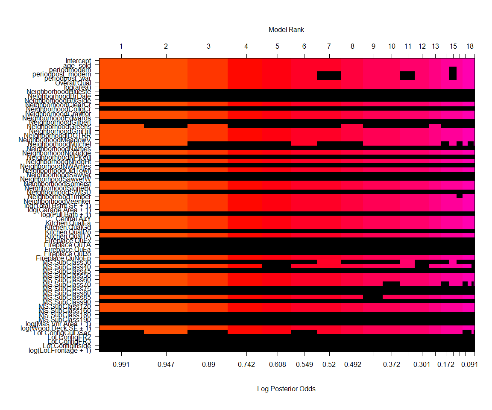
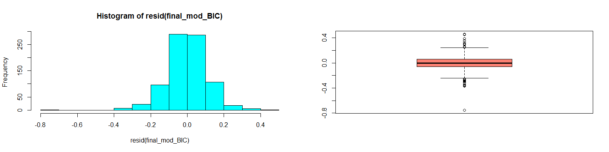

# Background

As a statistical consultant working for a real estate investment firm, your task is to develop a model to predict the selling price of a given home in Ames, Iowa. Your employer hopes to use this information to help assess whether the asking price of a house is higher or lower than the true value of the house. If the home is undervalued, it may be a good investment for the firm.

# Training Data and relevant packages

In order to better assess the quality of the model you will produce, the data have been randomly divided into three separate pieces: a training data set, a testing data set, and a validation data set. For now we will load the training data set, the others will be loaded and used later.


```r
load("data/ames_train.Rdata")
```

Use the code block below to load any necessary packages


```r
library(statsr)
library(dplyr)
library(BAS)
options(scipen = 9)
library(car)
library(tidyr)
library(purrr)
library(ggplot2)
library(gridExtra)
library(forcats)
library(corrplot)
library(magrittr)
```

###Tidying Data

We replace the missing values in the data with 0 in numeric variables and a new level in factor variables based on the code book.


## Part 1 - Exploratory Data Analysis (EDA)

After doing a detailed EDA of the ames_train data set, I found the following three graphs/plots most informative which guided me in my decisions as to which predictors I would want for my model.

* * *

### Interesting plots


The data we'll be using for this exercise was prepared by Dean De Cock for his students at Truman State University. It contains information from the Ames Assessor's Office used in computing assessed values for individual residential properties sold in Ames, IA from 2006 to 2010. The variable `Year.Built` contains information about the year when the house was built.  The variable `Year.Remod.Add` contains information about the year when the house was remodelled. However, in cases where no remodelling was done, value from the variable `Year.Built` is used instead.


```
## Warning: Using size for a discrete variable is not advised.
```


I found this plot interesting because of the cluster of points on the upper right corner. Judging from the regression line, the group of points are potential outliers with prices way above the rest of the other houses and the regression line. The size of these points have been made larger to highlight their unique characteristics. The size of the data points vary according to Sale conditions, the smallest refers to normal while the biggest refer to partial Sale Conditions, meaning the house was not even finished when it was assessed. It is obvious from the plot that most sale conditions are categorized as normal. Sale conditions that are not normal like sale between family members, foreclosure, trade and others influence house price in addition to the intrinsic characteristics of the house. Below is a table of comparing the median prices of houses under different sale conditions.


```r
with(yr_df, tapply(price, Sale.Condition, median))
```

```
##   Normal  Abnorml  AdjLand   Alloca   Family  Partial 
## 155500.0 132000.0 138750.0 152556.5 149000.0 254146.5
```

I also found out that most of these houses were were sold within a year after it was built or remodelled. They are characterized by having a high Overall rating and their mean price as a group was **282779.8** while the rest of the houses not part of the group had a mean of **172152.0**. 

Of course, newer houses are expected to fetch a higher price. But houses that are sold within a year it was built makes me think that the motive for building the house was profit. A higher quality rating would likewise serve to ensure that the builder gets the most out of his investment. 

Knowing these characteristics I created a new variable called `age_sold` which has levels that mark if a house was sold within a year, between 1 and 5, between 5 and 10, between 10 and 25, between 25 and 50, and more than 50 years.

Removing this points from our data by limiting `Sale.Condition` to normal sales only, as we will be doing later, lowers our estimate for the price of houses recently built and sold as shown by the red regression line. The black regression line is the result when `Sale.Condition` is not limited to normal sales only.            
Other factors that affect the economy like employment, economic growth or depression affects the supply and demand dynamics for houses. The dataset does not contain these information. I found the plot below interesting because we can glean some insights about this factors from the data indirectly.

<!-- -->

You probably noticed right away that this plot of `Year.Built` and `price` have been cropped. The top part which contains the data points discussed earlier was not shown.The units for price is still in dollars but the true value has been divided by 1000 to accomodate the scale for the number of houses. 

Sharing the scale for the y-axis are:

* the price/1000 of houses in the data as indicated by the blue, green, red, and black data points,

* the number of houses built every year as shown by the black line at the bottom, 

* the number of houses remodelled every year as shown by the blue line at the bottom,

* the number of houses sold each year from 2006 to 2010 as shown by the green line at the upper right corner, and

* The median price/1000 for the years between 2006 to 2010 as shown by the red stairlike line on the upper right corner.

The thin diagonal red line is the regression line that predicts the prices of houses in Ames, Iowa across time from 1872 to 2010.

Looking at the plot above we can spot some trends. There was a massive number (**111**) of houses that was remodelled after the war in 1950 as indicated by the vertical blue line in the center. 

The data points corresponding to each house in the data were given different colors to indicate different periods in time where there was an increase in building or remodelling activity. If you place a separate regression line on each period, you will find a different slope for each period of time. The blue data points indicate the houses that were built before 1946, Which i called pre_war for lack of a better name. The green, for the period 1946-1985. Red, for 1986-2002 and black points for 2003-2010. Below are the coefficients/slopes for each period in time as compared to the post modern period of 2003 to 2010. On this basis, I created a new variable called period to reflect this information.


```r
summary(per_mod)
```

```
## 
## Call:
## lm(formula = price/1000 ~ period, data = yr_df)
## 
## Residuals:
##     Min      1Q  Median      3Q     Max 
## -132.18  -36.72   -7.95   21.05  352.82 
## 
## Coefficients:
##                   Estimate Std. Error t value Pr(>|t|)    
## (Intercept)        127.948      4.650  27.518  < 2e-16 ***
## periodmodern        93.380      6.641  14.061  < 2e-16 ***
## periodpost_modern  134.237      6.265  21.428  < 2e-16 ***
## periodpost_war      17.006      5.556   3.061  0.00227 ** 
## ---
## Signif. codes:  0 '***' 0.001 '**' 0.01 '*' 0.05 '.' 0.1 ' ' 1
## 
## Residual standard error: 62.55 on 996 degrees of freedom
## Multiple R-squared:  0.4185,	Adjusted R-squared:  0.4168 
## F-statistic:   239 on 3 and 996 DF,  p-value: < 2.2e-16
```

What's interesting is the years **2007 - 2010**. There was a downward trend in the number of houses built or remodelled. The number of houses built went down from **38 to 1**. The number of houses remodelled went down from **32 to 3**. The number of houses sold went down from **234 to 108**, a more than a **50%** drop in the number of houses sold. The median price of houses sold each year went down from **165500 to 152000**, only an 8% drop. There was a decline in the demand for houses during this period and therefore we can expect the prices to drop but our regression line still predicts an increase in price for this period.

We have seen how the time component explains the trend in the prices across time but we also have seen how time is inadequate to compensate for the up and down movement of prices across the different periods. 

<!-- -->

The variable `Overall.Qual` is a rating or score given to a houses. Ratings or scores are usually arbitrary but in this instance it seems to be right on the mark. 

We'll try to incorporate the variable `Overall.Qual` and `Neighborhood`into the picture to see how this can account for the variation in prices. Both exhibit a linear relationship with price as shown by the plots above and are strong predictors based on their correlation coefficients (not shown).

* * *

## Part 2 - Development and assessment of an initial model, following a semi-guided process of analysis

### Section 2.1 An Initial Model

The following are the steps I took in my attempt to create a simple initial model based on the results of the Exploratory Data Analysis I previously performed. 

* * *

I chose the variables `area` and `Overall.Qual` because they are strong predictors of price based on their correlation coefficient with the variable `price`. I chose the variable `age-sold` because it incorporates the information Year.Built and how many years thereafter was the house sold. This relationship also follows a linear relationship.  I also chose the variable `period` to fine tune the prediction  according to the year the house was built. I chose `Neighborhood` based on the advise of the course creator and because the median prices for the different neighborhoods follow a linear relationship. The same relationship applies to `Total.Bsmt.SF` and `Garage.Area`. `Garage.Area` is a barometer for price. More cars means more wealth. Hence, a bigger and better quality house that costs more.


```r
yr_df <- na.omit(yr_df)
init_mod <- lm(log(price) ~ age_sold + Overall.Qual + period + area + Neighborhood + Total.Bsmt.SF + Garage.Area, data = yr_df )
summary(init_mod)
```

```
## 
## Call:
## lm(formula = log(price) ~ age_sold + Overall.Qual + period + 
##     area + Neighborhood + Total.Bsmt.SF + Garage.Area, data = yr_df)
## 
## Residuals:
##      Min       1Q   Median       3Q      Max 
## -1.78356 -0.06286  0.00671  0.08596  0.41068 
## 
## Coefficients:
##                        Estimate  Std. Error t value         Pr(>|t|)    
## (Intercept)         10.87782246  0.07287781 149.261          < 2e-16 ***
## age_sold            -0.03446982  0.00497185  -6.933 0.00000000000754 ***
## Overall.Qual         0.09884901  0.00672564  14.697          < 2e-16 ***
## periodmodern         0.09646367  0.03245492   2.972          0.00303 ** 
## periodpost_modern    0.05418959  0.03652209   1.484          0.13820    
## periodpost_war       0.07067910  0.02471766   2.859          0.00434 ** 
## area                 0.00022624  0.00001465  15.445          < 2e-16 ***
## NeighborhoodBlueste -0.05383624  0.10738099  -0.501          0.61623    
## NeighborhoodBrDale  -0.22235799  0.07437194  -2.990          0.00286 ** 
## NeighborhoodBrkSide  0.00469811  0.06255443   0.075          0.94015    
## NeighborhoodClearCr  0.16182016  0.06977752   2.319          0.02060 *  
## NeighborhoodCollgCr  0.03780876  0.05252731   0.720          0.47183    
## NeighborhoodCrawfor  0.19031904  0.06229239   3.055          0.00231 ** 
## NeighborhoodEdwards -0.02945018  0.05650920  -0.521          0.60238    
## NeighborhoodGilbert  0.05986370  0.05464091   1.096          0.27353    
## NeighborhoodGreens   0.09895236  0.09767514   1.013          0.31128    
## NeighborhoodGrnHill  0.49867420  0.12462206   4.001 0.00006777223990 ***
## NeighborhoodIDOTRR  -0.16463456  0.06376857  -2.582          0.00998 ** 
## NeighborhoodMeadowV -0.17642667  0.06786299  -2.600          0.00947 ** 
## NeighborhoodMitchel  0.07797111  0.05722429   1.363          0.17334    
## NeighborhoodNAmes    0.03302621  0.05536717   0.596          0.55099    
## NeighborhoodNoRidge  0.12076942  0.06106507   1.978          0.04825 *  
## NeighborhoodNPkVill -0.05990326  0.09656892  -0.620          0.53520    
## NeighborhoodNridgHt  0.12620868  0.05363009   2.353          0.01881 *  
## NeighborhoodNWAmes   0.04127114  0.05937402   0.695          0.48716    
## NeighborhoodOldTown -0.09641761  0.06013173  -1.603          0.10917    
## NeighborhoodSawyer   0.05335356  0.05767067   0.925          0.35512    
## NeighborhoodSawyerW -0.00109482  0.05560070  -0.020          0.98429    
## NeighborhoodSomerst  0.05793966  0.05204760   1.113          0.26590    
## NeighborhoodStoneBr  0.18145288  0.06104196   2.973          0.00303 ** 
## NeighborhoodSWISU    0.00520939  0.07478381   0.070          0.94448    
## NeighborhoodTimber   0.11623677  0.06150516   1.890          0.05908 .  
## NeighborhoodVeenker  0.10633735  0.07320233   1.453          0.14665    
## Total.Bsmt.SF        0.00014620  0.00001648   8.870          < 2e-16 ***
## Garage.Area          0.00018691  0.00003219   5.806 0.00000000866185 ***
## ---
## Signif. codes:  0 '***' 0.001 '**' 0.01 '*' 0.05 '.' 0.1 ' ' 1
## 
## Residual standard error: 0.1601 on 963 degrees of freedom
## Multiple R-squared:  0.8604,	Adjusted R-squared:  0.8554 
## F-statistic: 174.5 on 34 and 963 DF,  p-value: < 2.2e-16
```

It was surprising for me to find none of the coefficient for `period` had a significant pvalue at first so i changed the reference factor level to pre_war. The levels post_war and modern then had a significant pvalue.

* * *

### Section 2.2 Model Selection

Using the initial model as a starting point, I will use different model selection methods and compare their results. 

* * *

I used the BAS, AIC, and BIC stepwise selection procedure. The AIC model preserved the full model while the BIC model removed `period`. the BAS model showed the marginal inclusion probabilty for the levels of the factor variable `period` and `Neighborhood` which aided in deciding which model to choose. The R-Squared coefficient for the BIC model was nearly the same as the AIC model despite having one less predictor. The AIC model included the variable `period` but the coefficients for the levels `modern` and `postwar` appear as positive instead of negative. I choose the BIC model as my initial model.


```r
library(MASS)
model_AIC <- stepAIC(init_mod, k = 2, trace = FALSE)
summary(model_AIC)
```

```
## 
## Call:
## lm(formula = log(price) ~ age_sold + Overall.Qual + period + 
##     area + Neighborhood + Total.Bsmt.SF + Garage.Area, data = yr_df)
## 
## Residuals:
##      Min       1Q   Median       3Q      Max 
## -1.78356 -0.06286  0.00671  0.08596  0.41068 
## 
## Coefficients:
##                        Estimate  Std. Error t value         Pr(>|t|)    
## (Intercept)         10.87782246  0.07287781 149.261          < 2e-16 ***
## age_sold            -0.03446982  0.00497185  -6.933 0.00000000000754 ***
## Overall.Qual         0.09884901  0.00672564  14.697          < 2e-16 ***
## periodmodern         0.09646367  0.03245492   2.972          0.00303 ** 
## periodpost_modern    0.05418959  0.03652209   1.484          0.13820    
## periodpost_war       0.07067910  0.02471766   2.859          0.00434 ** 
## area                 0.00022624  0.00001465  15.445          < 2e-16 ***
## NeighborhoodBlueste -0.05383624  0.10738099  -0.501          0.61623    
## NeighborhoodBrDale  -0.22235799  0.07437194  -2.990          0.00286 ** 
## NeighborhoodBrkSide  0.00469811  0.06255443   0.075          0.94015    
## NeighborhoodClearCr  0.16182016  0.06977752   2.319          0.02060 *  
## NeighborhoodCollgCr  0.03780876  0.05252731   0.720          0.47183    
## NeighborhoodCrawfor  0.19031904  0.06229239   3.055          0.00231 ** 
## NeighborhoodEdwards -0.02945018  0.05650920  -0.521          0.60238    
## NeighborhoodGilbert  0.05986370  0.05464091   1.096          0.27353    
## NeighborhoodGreens   0.09895236  0.09767514   1.013          0.31128    
## NeighborhoodGrnHill  0.49867420  0.12462206   4.001 0.00006777223990 ***
## NeighborhoodIDOTRR  -0.16463456  0.06376857  -2.582          0.00998 ** 
## NeighborhoodMeadowV -0.17642667  0.06786299  -2.600          0.00947 ** 
## NeighborhoodMitchel  0.07797111  0.05722429   1.363          0.17334    
## NeighborhoodNAmes    0.03302621  0.05536717   0.596          0.55099    
## NeighborhoodNoRidge  0.12076942  0.06106507   1.978          0.04825 *  
## NeighborhoodNPkVill -0.05990326  0.09656892  -0.620          0.53520    
## NeighborhoodNridgHt  0.12620868  0.05363009   2.353          0.01881 *  
## NeighborhoodNWAmes   0.04127114  0.05937402   0.695          0.48716    
## NeighborhoodOldTown -0.09641761  0.06013173  -1.603          0.10917    
## NeighborhoodSawyer   0.05335356  0.05767067   0.925          0.35512    
## NeighborhoodSawyerW -0.00109482  0.05560070  -0.020          0.98429    
## NeighborhoodSomerst  0.05793966  0.05204760   1.113          0.26590    
## NeighborhoodStoneBr  0.18145288  0.06104196   2.973          0.00303 ** 
## NeighborhoodSWISU    0.00520939  0.07478381   0.070          0.94448    
## NeighborhoodTimber   0.11623677  0.06150516   1.890          0.05908 .  
## NeighborhoodVeenker  0.10633735  0.07320233   1.453          0.14665    
## Total.Bsmt.SF        0.00014620  0.00001648   8.870          < 2e-16 ***
## Garage.Area          0.00018691  0.00003219   5.806 0.00000000866185 ***
## ---
## Signif. codes:  0 '***' 0.001 '**' 0.01 '*' 0.05 '.' 0.1 ' ' 1
## 
## Residual standard error: 0.1601 on 963 degrees of freedom
## Multiple R-squared:  0.8604,	Adjusted R-squared:  0.8554 
## F-statistic: 174.5 on 34 and 963 DF,  p-value: < 2.2e-16
```

```r
model_BIC <- stepAIC( init_mod, k = log(nrow(yr_df)), trace = FALSE)
summary(model_BIC)
```

```
## 
## Call:
## lm(formula = log(price) ~ age_sold + Overall.Qual + area + Neighborhood + 
##     Total.Bsmt.SF + Garage.Area, data = yr_df)
## 
## Residuals:
##      Min       1Q   Median       3Q      Max 
## -1.79456 -0.06096  0.00983  0.08648  0.42263 
## 
## Coefficients:
##                        Estimate  Std. Error t value          Pr(>|t|)    
## (Intercept)         10.92961188  0.06593790 165.756           < 2e-16 ***
## age_sold            -0.03192598  0.00433125  -7.371 0.000000000000363 ***
## Overall.Qual         0.09882726  0.00657538  15.030           < 2e-16 ***
## area                 0.00022465  0.00001454  15.451           < 2e-16 ***
## NeighborhoodBlueste -0.04572466  0.10606668  -0.431          0.666497    
## NeighborhoodBrDale  -0.21579532  0.07240185  -2.981          0.002950 ** 
## NeighborhoodBrkSide -0.05293791  0.05718553  -0.926          0.354822    
## NeighborhoodClearCr  0.16059927  0.06759436   2.376          0.017699 *  
## NeighborhoodCollgCr  0.05492305  0.05199013   1.056          0.291044    
## NeighborhoodCrawfor  0.15228407  0.05902950   2.580          0.010033 *  
## NeighborhoodEdwards -0.03670591  0.05498548  -0.668          0.504576    
## NeighborhoodGilbert  0.07716924  0.05445762   1.417          0.156790    
## NeighborhoodGreens   0.10516166  0.09529115   1.104          0.270049    
## NeighborhoodGrnHill  0.53431949  0.12429379   4.299 0.000018909895829 ***
## NeighborhoodIDOTRR  -0.22139659  0.05897772  -3.754          0.000184 ***
## NeighborhoodMeadowV -0.16901294  0.06580949  -2.568          0.010372 *  
## NeighborhoodMitchel  0.09247886  0.05572097   1.660          0.097304 .  
## NeighborhoodNAmes    0.03686771  0.05236765   0.704          0.481592    
## NeighborhoodNoRidge  0.15646899  0.05926489   2.640          0.008420 ** 
## NeighborhoodNPkVill -0.05456346  0.09505023  -0.574          0.566068    
## NeighborhoodNridgHt  0.12407607  0.05386301   2.304          0.021460 *  
## NeighborhoodNWAmes   0.05046535  0.05658348   0.892          0.372682    
## NeighborhoodOldTown -0.14882814  0.05492397  -2.710          0.006853 ** 
## NeighborhoodSawyer   0.05613583  0.05485072   1.023          0.306361    
## NeighborhoodSawyerW  0.01498451  0.05512291   0.272          0.785805    
## NeighborhoodSomerst  0.06390629  0.05224907   1.223          0.221587    
## NeighborhoodStoneBr  0.18875434  0.06108231   3.090          0.002058 ** 
## NeighborhoodSWISU   -0.06184292  0.07015399  -0.882          0.378250    
## NeighborhoodTimber   0.12893218  0.06136583   2.101          0.035896 *  
## NeighborhoodVeenker  0.12020947  0.07160791   1.679          0.093530 .  
## Total.Bsmt.SF        0.00015109  0.00001641   9.208           < 2e-16 ***
## Garage.Area          0.00018301  0.00003215   5.693 0.000000016566197 ***
## ---
## Signif. codes:  0 '***' 0.001 '**' 0.01 '*' 0.05 '.' 0.1 ' ' 1
## 
## Residual standard error: 0.1609 on 966 degrees of freedom
## Multiple R-squared:  0.8585,	Adjusted R-squared:  0.854 
## F-statistic: 189.1 on 31 and 966 DF,  p-value: < 2.2e-16
```

```r
library(BAS)
model_BAS <- bas.lm( log(price) ~  age_sold + Overall.Qual + period + area + Neighborhood + Total.Bsmt.SF + Garage.Area, data = yr_df, prior = "BIC", modelprior=uniform(), method = "MCMC", MCMC.iterations=500000)
```


```r
par(mar = c(1,4,1,0), oma = c(1,4,1,0))
image(model_BAS, rotate = F)
```

<!-- -->

```r
model_BAS
```

```
## 
## Call:
## bas.lm(formula = log(price) ~ age_sold + Overall.Qual + period +     area + Neighborhood + Total.Bsmt.SF + Garage.Area, data = yr_df,     prior = "BIC", modelprior = uniform(), method = "MCMC", MCMC.iterations = 500000)
## 
## 
##  Marginal Posterior Inclusion Probabilities: 
##           Intercept             age_sold         Overall.Qual  
##             1.00000              0.99988              0.99993  
##        periodmodern    periodpost_modern       periodpost_war  
##             0.93290              0.41476              0.86523  
##                area  NeighborhoodBlueste   NeighborhoodBrDale  
##             0.99995              0.05622              0.99955  
## NeighborhoodBrkSide  NeighborhoodClearCr  NeighborhoodCollgCr  
##             0.20664              0.46579              0.06338  
## NeighborhoodCrawfor  NeighborhoodEdwards  NeighborhoodGilbert  
##             0.97042              0.75787              0.04048  
##  NeighborhoodGreens  NeighborhoodGrnHill   NeighborhoodIDOTRR  
##             0.03485              0.98558              0.99999  
## NeighborhoodMeadowV  NeighborhoodMitchel    NeighborhoodNAmes  
##             0.99976              0.06790              0.05136  
## NeighborhoodNoRidge  NeighborhoodNPkVill  NeighborhoodNridgHt  
##             0.16139              0.07019              0.53952  
##  NeighborhoodNWAmes  NeighborhoodOldTown   NeighborhoodSawyer  
##             0.03971              0.99997              0.04276  
## NeighborhoodSawyerW  NeighborhoodSomerst  NeighborhoodStoneBr  
##             0.28570              0.04029              0.76261  
##   NeighborhoodSWISU   NeighborhoodTimber  NeighborhoodVeenker  
##             0.07885              0.09884              0.04689  
##       Total.Bsmt.SF          Garage.Area  
##             0.99996              1.00000
```

* * *

### Section 2.3 Initial Model Residuals

Below are plots of the residual of our chosen initial model, the BIC model.

* * *

* There are some houses in the train data set which contain sale conditions that may involve trade of houses. We will be limiting the data to sale conditions that are normal later on but at the moment we cannot assume the prices of the houses are independent.

* The residuals appear to be normally distributed over 0 except for some extreme values.  The plot identifies 3 possible outliers but doesn't appear to be very influential.


* The plot of the residuals against fitted values is quite linear. Stray points however can be found below the trend line.  These points are houses where our model predicted a higher price than the actual price. The plots identified these points **310**, **428**, and **276** as possible outliers. 

<!-- -->

```
##   rownum Year.Built Year.Remod.Add remodelled built_remodelled_sold
## 1    428       1923           1970       TRUE                 FALSE
## 2    310       2007           2008       TRUE                  TRUE
## 3    276       1977           1977      FALSE                 FALSE
##        period age_remod age age_since_remod area Neighborhood
## 1     pre_war        47  87              40  832      OldTown
## 2 post_modern         1   0              -1 4676      Edwards
## 3    post_war         0  31              31 2944      Veenker
##   Total.Bsmt.SF Garage.Area Overall.Qual Sale.Condition  price pred_price
## 1           678         780            2        Abnorml  12789   76949.14
## 2          3138         884           10        Partial 184750  755860.40
## 3           994         864            9         Family 150000  344312.99
##   difference
## 1  -64160.14
## 2 -571110.40
## 3 -194312.99
```

House 310 is one of two houses that were sold first and then remodelled. It was built and sold in 2007 but remodelled in 2008. It has the largest basement and can accomodate 3 cars in its garage. For a house that had 4676 square feet of living `area` with an `Overall.Qual` rating of 10, this house was bought unbelievably cheap. However, if we looked at the variable `Sale.condition`, we can see that the house was sold not in a normal condition. It is listed as partial, meaning the house was assessed even before the house was completed.

<!-- -->

Looking at the plots above we get more insights as to why this 3 houses appear as outliers compared to the rest of the houses.  House 428 has the lowest price among the houses that were built in 1923, during the pre war period, located in OldTown, a neigborhood with low priced houses. In fact, it was the lowest priced house in the whole training dataset. Even among houses sold between 25 to 50 years after it was built, it is distantly low. It's interesting that it doesn't even have the smallest `Lot.Area` in the data.  

The variable `Overall.Qual`, which rates the overall material and finish of the house, tells us that house 428 got a rating of 2 equivalent to `poor`.

Based on all this, a plot comparing price with one of the variables mentioned above, will have a regression line that will overpredict the price of house 428. Yet, if we look at the plot of price against `Overall.Qual` it is interesting to see the regression line below house 428, meaning a linear model based on price and Overall.Qual will under predict the price of house 428. If we look at the condition of the sale of this house, we find it listed as abnormal, meaning the sale might have been part of a trade, foreclosure proceeding, which eventually resulted in the immediate sale of the house.
 
House 276 was built in 1977, never remodelled and sold in 2008. Compared to houses sold when it was between 25 to 50 years old and built in the post war period in our data, the price was well within the median prices of all houses in the same category. However, compared to houses that had a an `Overall.Qual` rating of 9 and a `area` of almost 3000 square feet, The price was very low. Compared to houses located in Veenker, a neighborhood with moderately priced house, the price was way too low. If we look at the condition of the sale, this house was sold to a family member, hence the low price.

How do we handle this houses? Are they outliers? We'll It seems the process in figuring out the prices for these houses are different. Their prices are affected by factors such as trade, family relationships, foreclosure, or the house was unfinished at the time of assessment. We will be limiting our model to predict only on houses that are sold under normal conditions. Besides, trade of houses violate our model's assumption that observations are independent of each other. 

But before we limit `Sale.Condition` to normal transactions only, I ask the question, why didn't our model consider the other houses that were sold on conditions other than normal as outliers? They certainly were far from the  best fitted line as we saw earlier. let's investigate.

There are 165 houses that were sold under sale conditions other than normal


```
## # A tibble: 6 x 7
##   row_no Sale.Condition  price pred_price       diff  over under
##    <int>         <fctr>  <int>      <dbl>      <dbl> <lgl> <lgl>
## 1    276         Family 150000  344312.99 -194312.99  TRUE FALSE
## 2    310        Partial 184750  755860.40 -571110.40  TRUE FALSE
## 3    428        Abnorml  12789   76949.14  -64160.14  TRUE FALSE
## 4    583        Partial 611657  418479.37  193177.63 FALSE  TRUE
## 5    690        Partial 308030  203631.05  104398.95 FALSE  TRUE
## 6    869        Partial 440000  334706.79  105293.21 FALSE  TRUE
```

WHOOOAAA!!!  Using our model to predict on the training dataset, same dataset which we used to train our model, we can see other houses sold on conditions other than normal, had large differences in actual and predicted price as well. Why weren't they tagged as outliers? I guess large difference in predicted price and actual price doesn't make an observation an outlier outright.

<!-- -->

<!-- -->


The plots above show where the houses that were sold under sale conditons other than normal are located in our dataset. They occupy the full spectrum of our house prices but you can notice that a lot of them are at the extremes.


```r
yr_df <- yr_df %>% filter(Sale.Condition == "Normal")
model_BIC2 <- lm(log(price) ~ age_sold + Overall.Qual + area + Neighborhood + Total.Bsmt.SF + Garage.Area, data = yr_df)
model_AIC <- lm(log(price) ~ age_sold + Overall.Qual + period + area + Neighborhood + Total.Bsmt.SF + Garage.Area, data = yr_df)
```

After removing the rows in our training dataset containing sale conditions other than normal, we train our model again on the training data. Below are the plot of the residuals. The previously identified oultiers were removed from the data. New outliers however, have been identified but the magnitude of the residuals of these outliers are considerably less than the previously tagged outliers.

<!-- -->

A new model comes with a new set of outliers.

* * *

### Section 2.4 Initial Model RMSE

To analyze the performance of the model, we will compute the Root Mean Squared (RMSE) of the prediction of the model on the training dataset. We will report our prediction in dollars to make it  more meaningful and intuitive.

* * *


```r
RMSE <- function(model, dataset) {
  pred_price <- exp(predict(model, dataset))
  resids <- dataset$price - pred_price
  rmse <- sqrt(mean(resids^2)) 
  rmse
}
```

I created a function that will compute the Root Mean squared model predicting on a particular data set.


```r
RMSE(model_BIC2, yr_df) ###RMSE for BIC model predicting on the training dataset
```

```
## [1] 21516.79
```


```
## [1] "The RMSE for the BIC model predicting on the training dataset is 21516.79 dollars"
```


* * *

### Section 2.5 Overfitting 

A model may do well on training data but perform poorly out-of-sample (meaning, on a dataset other than the original training data) because the model is overly-tuned to specifically fit the training data. This is called **overfitting**. To determine whether overfitting is occurring on a model, we compare the performance of a model on both in-sample and out-of-sample data sets. We now load our testing data set, `ames_test`.


```r
load("data/ames_test.Rdata")
```

###Tidying the testing dataset

We perform the same pre-processing procedured on the testing dataset to replace the missing values in the data with 0 in numeric variables and or a new level in factor variables based on the code book.


We now generate predictions for the housing prices in the test data set and compare our models accuracy for predicting the actual prices in the testing and training dataset.

* * *


The ames_test dataset includes a new level `Landmrk` in the variable Neighborhood. Predicting on the testing dataset using our model encounters an error as this level was not present when the model was trained  on the training dataset. I deleted this row of observation from the testing dataset in order to move forward. Furthermore, the levels for `Sale.Condition` is already limited to normal only in the testing dataset provided.


```
## [1] "The RMSE for the BIC model predicting on the testing dataset is 21426.59 dollars"
```

```
## [1] "The RMSE for the BIC model predicting on the training dataset is 21516.79 dollars"
```

To compare the performance of our model in the training and testing dataset, we look at the plot below.


<!-- -->

The red points are the actual prices on the dataset while the blue circles are the predicted prices. You can see that the difference between the actual and predicted price is greater on the training set. The RMSE for the BIC model predicting on the training dataset is higher by 90.2 dollars.

I choose the BIC model as my initial model which did not include the variable `period`. The coefficients for the period post_war was larger than the period post_modern, which was not what we observed in the data. 

Since the BIC model predicts better on the test set compared to the training set, our model appears **NOT** to be suffering from overfitting. 

Before we go to the next step of developing a final model.  Let's try to see the effect of not limiting our date to houses sold under normal conditions.

Predicting on the training dataset, the RMSE for the model trained on the data not limited to normal sale condition is **22370.19** while the RMSE computed using the same model trained on the data limited to normal sale condition is **21516.79**. Limiting `Sale.Condition` to normal sale conditions, reduced our prediction errors by **853.41** dollars.


Predicting on the testing dataset, the RMSE for the model trained on the data not limited to normal sale condition is **22168.41** while the RMSE computed using the same model trained on the data limited to normal sale condition is **21426.59**. Limiting `Sale.Condition` to normal sale conditions, reduced our prediction errors by **741.82** dollars.


* * *

**Note to the learner:** If in real-life practice this out-of-sample analysis shows evidence that the training data fits your model a lot better than the test data, it is probably a good idea to go back and revise the model (usually by simplifying the model) to reduce this overfitting. 

## Part 3 Development of a Final Model

We now set ourselves to the task of creating a final model by adding more predictors to our model. We try different combinations of variables in the dataset in the hope of incorporating more information into the model that will explain the variance in House prices and at the same time improve our models accuracy.

Below are the factors that influenced our decision in making the final model.

### Section 3.1 Final Model

Since the RMSE for the initial model was quite acceptable and overfitting does not appear to be an issue, we'll try to add more variables in the hope of maximizing the information our model can provide and maybe even further reduce the RMSE. I'll try to include the variable `period` again.

Here is a summary of the initial group of predictors we tried to incorporate in the final model.


```r
final_mod <- lm(log(price) ~ age_sold + period + Overall.Qual + log(area) + Neighborhood + log(Total.Bsmt.SF + 1) + log(Garage.Cars + 1) + log(Full.Bath + 1) + Central.Air + Kitchen.Qual + Fireplace.Qu + MS.SubClass + log(Mas.Vnr.Area + 1) + log(Wood.Deck.SF + 1) + Lot.Config + log(Lot.Frontage + 1), data = yr_df)
summary(final_mod)
```

```
## 
## Call:
## lm(formula = log(price) ~ age_sold + period + Overall.Qual + 
##     log(area) + Neighborhood + log(Total.Bsmt.SF + 1) + log(Garage.Cars + 
##     1) + log(Full.Bath + 1) + Central.Air + Kitchen.Qual + Fireplace.Qu + 
##     MS.SubClass + log(Mas.Vnr.Area + 1) + log(Wood.Deck.SF + 
##     1) + Lot.Config + log(Lot.Frontage + 1), data = yr_df)
## 
## Residuals:
##      Min       1Q   Median       3Q      Max 
## -0.75069 -0.06000 -0.00054  0.06397  0.46848 
## 
## Coefficients:
##                          Estimate Std. Error t value Pr(>|t|)    
## (Intercept)             8.1980832  0.1867390  43.901  < 2e-16 ***
## age_sold               -0.0183203  0.0040091  -4.570 5.69e-06 ***
## periodmodern            0.0963285  0.0328580   2.932 0.003472 ** 
## periodpost_modern       0.0555951  0.0362364   1.534 0.125385    
## periodpost_war          0.0473756  0.0273191   1.734 0.083292 .  
## Overall.Qual            0.0581095  0.0058450   9.942  < 2e-16 ***
## log(area)               0.4496318  0.0263983  17.033  < 2e-16 ***
## NeighborhoodBlueste    -0.0087450  0.0870360  -0.100 0.919993    
## NeighborhoodBrDale     -0.1033265  0.0724440  -1.426 0.154191    
## NeighborhoodBrkSide    -0.0050509  0.0585438  -0.086 0.931270    
## NeighborhoodClearCr     0.1215028  0.0625450   1.943 0.052425 .  
## NeighborhoodCollgCr    -0.0155202  0.0517423  -0.300 0.764295    
## NeighborhoodCrawfor     0.1316668  0.0579124   2.274 0.023269 *  
## NeighborhoodEdwards    -0.0718175  0.0542581  -1.324 0.186021    
## NeighborhoodGilbert    -0.0320192  0.0537320  -0.596 0.551415    
## NeighborhoodGreens      0.1370301  0.0762786   1.796 0.072818 .  
## NeighborhoodGrnHill     0.5589282  0.0937968   5.959 3.87e-09 ***
## NeighborhoodIDOTRR     -0.1151512  0.0598904  -1.923 0.054888 .  
## NeighborhoodMeadowV    -0.1265146  0.0644665  -1.962 0.050067 .  
## NeighborhoodMitchel     0.0262865  0.0540395   0.486 0.626801    
## NeighborhoodNAmes      -0.0242606  0.0536129  -0.453 0.651027    
## NeighborhoodNoRidge     0.1151071  0.0557859   2.063 0.039414 *  
## NeighborhoodNPkVill     0.0063354  0.0773512   0.082 0.934744    
## NeighborhoodNridgHt     0.1123156  0.0512389   2.192 0.028680 *  
## NeighborhoodNWAmes      0.0197967  0.0549687   0.360 0.718837    
## NeighborhoodOldTown    -0.1101079  0.0567542  -1.940 0.052736 .  
## NeighborhoodSawyer     -0.0238407  0.0546003  -0.437 0.662495    
## NeighborhoodSawyerW    -0.0483635  0.0528147  -0.916 0.360102    
## NeighborhoodSomerst     0.0880783  0.0511449   1.722 0.085449 .  
## NeighborhoodStoneBr     0.0989232  0.0569111   1.738 0.082576 .  
## NeighborhoodSWISU      -0.0501203  0.0662449  -0.757 0.449528    
## NeighborhoodTimber      0.0638371  0.0565522   1.129 0.259328    
## NeighborhoodVeenker     0.1378813  0.0629988   2.189 0.028925 *  
## log(Total.Bsmt.SF + 1)  0.0281522  0.0040785   6.903 1.07e-11 ***
## log(Garage.Cars + 1)    0.1002927  0.0188360   5.325 1.33e-07 ***
## log(Full.Bath + 1)     -0.0091866  0.0317942  -0.289 0.772705    
## Central.AirY            0.1690094  0.0212888   7.939 7.25e-15 ***
## Kitchen.QualFa         -0.1459462  0.0384921  -3.792 0.000161 ***
## Kitchen.QualGd         -0.1194709  0.0230990  -5.172 2.96e-07 ***
## Kitchen.QualPo         -0.2133745  0.1246955  -1.711 0.087456 .  
## Kitchen.QualTA         -0.1732260  0.0256658  -6.749 2.93e-11 ***
## Fireplace.QuEx         -0.0479172  0.0386957  -1.238 0.215981    
## Fireplace.QuTA         -0.0365526  0.0146397  -2.497 0.012740 *  
## Fireplace.QuFa         -0.0059727  0.0278560  -0.214 0.830281    
## Fireplace.QuPo         -0.0436762  0.0300569  -1.453 0.146601    
## Fireplace.QuNoFp       -0.0591074  0.0133051  -4.442 1.02e-05 ***
## MS.SubClass30          -0.0538277  0.0302883  -1.777 0.075936 .  
## MS.SubClass40          -0.3784294  0.1166079  -3.245 0.001224 ** 
## MS.SubClass45          -0.0494609  0.0491934  -1.005 0.315004    
## MS.SubClass50          -0.0958943  0.0242638  -3.952 8.46e-05 ***
## MS.SubClass60          -0.0749201  0.0149585  -5.009 6.81e-07 ***
## MS.SubClass70          -0.1093455  0.0335626  -3.258 0.001172 ** 
## MS.SubClass75          -0.0338983  0.0522528  -0.649 0.516704    
## MS.SubClass80          -0.0301013  0.0211276  -1.425 0.154640    
## MS.SubClass85           0.0757977  0.0276682   2.740 0.006296 ** 
## MS.SubClass90          -0.0619863  0.0264967  -2.339 0.019571 *  
## MS.SubClass120         -0.0888005  0.0231582  -3.835 0.000136 ***
## MS.SubClass160         -0.2156202  0.0302739  -7.122 2.45e-12 ***
## MS.SubClass180         -0.0492397  0.0555634  -0.886 0.375794    
## MS.SubClass190         -0.0507872  0.0344004  -1.476 0.140260    
## log(Mas.Vnr.Area + 1)   0.0005451  0.0019325   0.282 0.777949    
## log(Wood.Deck.SF + 1)   0.0063676  0.0018109   3.516 0.000463 ***
## Lot.ConfigCulDSac       0.0280383  0.0186492   1.503 0.133133    
## Lot.ConfigFR2          -0.0447056  0.0234514  -1.906 0.056985 .  
## Lot.ConfigFR3          -0.0389281  0.0590631  -0.659 0.510034    
## Lot.ConfigInside       -0.0038215  0.0109295  -0.350 0.726697    
## log(Lot.Frontage + 1)   0.0030840  0.0026330   1.171 0.241850    
## ---
## Signif. codes:  0 '***' 0.001 '**' 0.01 '*' 0.05 '.' 0.1 ' ' 1
## 
## Residual standard error: 0.1124 on 766 degrees of freedom
## Multiple R-squared:  0.9203,	Adjusted R-squared:  0.9135 
## F-statistic: 134.1 on 66 and 766 DF,  p-value: < 2.2e-16
```


* * *

We turn again to the different model selection methods to help us determine which variables to keep or discard.


```r
library(MASS)
final_mod_AIC <- stepAIC(final_mod, k = 2, trace = FALSE)
summary(final_mod_AIC)
```

```
## 
## Call:
## lm(formula = log(price) ~ age_sold + period + Overall.Qual + 
##     log(area) + Neighborhood + log(Total.Bsmt.SF + 1) + log(Garage.Cars + 
##     1) + Central.Air + Kitchen.Qual + Fireplace.Qu + MS.SubClass + 
##     log(Wood.Deck.SF + 1) + Lot.Config, data = yr_df)
## 
## Residuals:
##      Min       1Q   Median       3Q      Max 
## -0.75039 -0.06263  0.00000  0.06239  0.46603 
## 
## Coefficients:
##                          Estimate Std. Error t value Pr(>|t|)    
## (Intercept)             8.2154990  0.1799706  45.649  < 2e-16 ***
## age_sold               -0.0182581  0.0039956  -4.570 5.69e-06 ***
## periodmodern            0.0965945  0.0327656   2.948 0.003295 ** 
## periodpost_modern       0.0584157  0.0360602   1.620 0.105654    
## periodpost_war          0.0481228  0.0271402   1.773 0.076606 .  
## Overall.Qual            0.0581011  0.0058108   9.999  < 2e-16 ***
## log(area)               0.4470269  0.0238435  18.748  < 2e-16 ***
## NeighborhoodBlueste     0.0004532  0.0861512   0.005 0.995804    
## NeighborhoodBrDale     -0.0936711  0.0717465  -1.306 0.192085    
## NeighborhoodBrkSide     0.0002203  0.0582631   0.004 0.996984    
## NeighborhoodClearCr     0.1229446  0.0624728   1.968 0.049430 *  
## NeighborhoodCollgCr    -0.0100450  0.0514890  -0.195 0.845374    
## NeighborhoodCrawfor     0.1350403  0.0577749   2.337 0.019677 *  
## NeighborhoodEdwards    -0.0664779  0.0539877  -1.231 0.218567    
## NeighborhoodGilbert    -0.0289200  0.0534781  -0.541 0.588815    
## NeighborhoodGreens      0.1470606  0.0752393   1.955 0.050996 .  
## NeighborhoodGrnHill     0.5569035  0.0934017   5.962 3.79e-09 ***
## NeighborhoodIDOTRR     -0.1111553  0.0596854  -1.862 0.062935 .  
## NeighborhoodMeadowV    -0.1214590  0.0640187  -1.897 0.058170 .  
## NeighborhoodMitchel     0.0324646  0.0536785   0.605 0.545492    
## NeighborhoodNAmes      -0.0187292  0.0532444  -0.352 0.725116    
## NeighborhoodNoRidge     0.1214792  0.0554119   2.192 0.028657 *  
## NeighborhoodNPkVill     0.0112723  0.0764458   0.147 0.882812    
## NeighborhoodNridgHt     0.1199536  0.0507221   2.365 0.018281 *  
## NeighborhoodNWAmes      0.0236056  0.0548057   0.431 0.666797    
## NeighborhoodOldTown    -0.1051783  0.0564787  -1.862 0.062947 .  
## NeighborhoodSawyer     -0.0199501  0.0543522  -0.367 0.713681    
## NeighborhoodSawyerW    -0.0431185  0.0525357  -0.821 0.412045    
## NeighborhoodSomerst     0.0918285  0.0509660   1.802 0.071975 .  
## NeighborhoodStoneBr     0.1046684  0.0564929   1.853 0.064298 .  
## NeighborhoodSWISU      -0.0470355  0.0660813  -0.712 0.476816    
## NeighborhoodTimber      0.0683953  0.0563466   1.214 0.225184    
## NeighborhoodVeenker     0.1476939  0.0620378   2.381 0.017522 *  
## log(Total.Bsmt.SF + 1)  0.0282841  0.0040625   6.962 7.18e-12 ***
## log(Garage.Cars + 1)    0.0994219  0.0187692   5.297 1.54e-07 ***
## Central.AirY            0.1692340  0.0212257   7.973 5.59e-15 ***
## Kitchen.QualFa         -0.1461897  0.0383315  -3.814 0.000148 ***
## Kitchen.QualGd         -0.1200742  0.0229438  -5.233 2.15e-07 ***
## Kitchen.QualPo         -0.2079002  0.1244242  -1.671 0.095149 .  
## Kitchen.QualTA         -0.1732687  0.0255371  -6.785 2.32e-11 ***
## Fireplace.QuEx         -0.0465642  0.0385972  -1.206 0.228030    
## Fireplace.QuTA         -0.0369758  0.0145315  -2.545 0.011137 *  
## Fireplace.QuFa         -0.0059771  0.0278107  -0.215 0.829887    
## Fireplace.QuPo         -0.0439568  0.0300169  -1.464 0.143493    
## Fireplace.QuNoFp       -0.0598602  0.0132543  -4.516 7.28e-06 ***
## MS.SubClass30          -0.0535063  0.0302201  -1.771 0.077031 .  
## MS.SubClass40          -0.3778983  0.1164761  -3.244 0.001228 ** 
## MS.SubClass45          -0.0479787  0.0490783  -0.978 0.328583    
## MS.SubClass50          -0.0950711  0.0240830  -3.948 8.62e-05 ***
## MS.SubClass60          -0.0758245  0.0148756  -5.097 4.34e-07 ***
## MS.SubClass70          -0.1067722  0.0328250  -3.253 0.001193 ** 
## MS.SubClass75          -0.0324043  0.0521375  -0.622 0.534444    
## MS.SubClass80          -0.0314825  0.0210486  -1.496 0.135142    
## MS.SubClass85           0.0743547  0.0275892   2.695 0.007191 ** 
## MS.SubClass90          -0.0631941  0.0260165  -2.429 0.015369 *  
## MS.SubClass120         -0.0917971  0.0229927  -3.992 7.17e-05 ***
## MS.SubClass160         -0.2189241  0.0300199  -7.293 7.57e-13 ***
## MS.SubClass180         -0.0515911  0.0552950  -0.933 0.351104    
## MS.SubClass190         -0.0496289  0.0342791  -1.448 0.148084    
## log(Wood.Deck.SF + 1)   0.0062582  0.0018065   3.464 0.000561 ***
## Lot.ConfigCulDSac       0.0231480  0.0180820   1.280 0.200872    
## Lot.ConfigFR2          -0.0466670  0.0233293  -2.000 0.045812 *  
## Lot.ConfigFR3          -0.0373147  0.0584761  -0.638 0.523586    
## Lot.ConfigInside       -0.0034290  0.0109086  -0.314 0.753346    
## ---
## Signif. codes:  0 '***' 0.001 '**' 0.01 '*' 0.05 '.' 0.1 ' ' 1
## 
## Residual standard error: 0.1123 on 769 degrees of freedom
## Multiple R-squared:  0.9202,	Adjusted R-squared:  0.9136 
## F-statistic: 140.7 on 63 and 769 DF,  p-value: < 2.2e-16
```

```r
final_mod_BIC <- stepAIC(final_mod, k = log(nrow(yr_df)), trace = FALSE)
summary(final_mod_BIC)
```

```
## 
## Call:
## lm(formula = log(price) ~ age_sold + Overall.Qual + log(area) + 
##     Neighborhood + log(Total.Bsmt.SF + 1) + log(Garage.Cars + 
##     1) + Central.Air + Kitchen.Qual + MS.SubClass + log(Wood.Deck.SF + 
##     1), data = yr_df)
## 
## Residuals:
##      Min       1Q   Median       3Q      Max 
## -0.75272 -0.06024  0.00055  0.06236  0.45988 
## 
## Coefficients:
##                          Estimate Std. Error t value Pr(>|t|)    
## (Intercept)             7.9754764  0.1641699  48.581  < 2e-16 ***
## age_sold               -0.0160116  0.0037981  -4.216 2.78e-05 ***
## Overall.Qual            0.0646184  0.0056664  11.404  < 2e-16 ***
## log(area)               0.4746295  0.0225904  21.010  < 2e-16 ***
## NeighborhoodBlueste     0.0307299  0.0859713   0.357 0.720856    
## NeighborhoodBrDale     -0.0814298  0.0702725  -1.159 0.246903    
## NeighborhoodBrkSide    -0.0116289  0.0562477  -0.207 0.836264    
## NeighborhoodClearCr     0.1379571  0.0613131   2.250 0.024724 *  
## NeighborhoodCollgCr     0.0049232  0.0503820   0.098 0.922181    
## NeighborhoodCrawfor     0.1352372  0.0563470   2.400 0.016625 *  
## NeighborhoodEdwards    -0.0627224  0.0528872  -1.186 0.235997    
## NeighborhoodGilbert     0.0016608  0.0527018   0.032 0.974869    
## NeighborhoodGreens      0.1444478  0.0728092   1.984 0.047614 *  
## NeighborhoodGrnHill     0.5740269  0.0938146   6.119 1.49e-09 ***
## NeighborhoodIDOTRR     -0.1256674  0.0578260  -2.173 0.030065 *  
## NeighborhoodMeadowV    -0.1047925  0.0626208  -1.673 0.094640 .  
## NeighborhoodMitchel     0.0443016  0.0520793   0.851 0.395221    
## NeighborhoodNAmes      -0.0158118  0.0513382  -0.308 0.758170    
## NeighborhoodNoRidge     0.1453997  0.0536840   2.708 0.006908 ** 
## NeighborhoodNPkVill    -0.0003669  0.0744237  -0.005 0.996068    
## NeighborhoodNridgHt     0.1362634  0.0503518   2.706 0.006954 ** 
## NeighborhoodNWAmes      0.0146104  0.0530801   0.275 0.783195    
## NeighborhoodOldTown    -0.1211040  0.0542037  -2.234 0.025750 *  
## NeighborhoodSawyer     -0.0135637  0.0526427  -0.258 0.796740    
## NeighborhoodSawyerW    -0.0343577  0.0516220  -0.666 0.505887    
## NeighborhoodSomerst     0.1059343  0.0506646   2.091 0.036860 *  
## NeighborhoodStoneBr     0.1242198  0.0559491   2.220 0.026690 *  
## NeighborhoodSWISU      -0.0630902  0.0648390  -0.973 0.330841    
## NeighborhoodTimber      0.0908918  0.0560579   1.621 0.105337    
## NeighborhoodVeenker     0.1526650  0.0602806   2.533 0.011518 *  
## log(Total.Bsmt.SF + 1)  0.0277186  0.0040729   6.806 2.00e-11 ***
## log(Garage.Cars + 1)    0.1014201  0.0187813   5.400 8.85e-08 ***
## Central.AirY            0.1678360  0.0214228   7.834 1.54e-14 ***
## Kitchen.QualFa         -0.1520489  0.0388603  -3.913 9.92e-05 ***
## Kitchen.QualGd         -0.1127080  0.0230500  -4.890 1.23e-06 ***
## Kitchen.QualPo         -0.2582527  0.1259354  -2.051 0.040632 *  
## Kitchen.QualTA         -0.1717001  0.0256651  -6.690 4.25e-11 ***
## MS.SubClass30          -0.0851832  0.0239782  -3.553 0.000404 ***
## MS.SubClass40          -0.4197685  0.1174414  -3.574 0.000373 ***
## MS.SubClass45          -0.0829853  0.0475790  -1.744 0.081525 .  
## MS.SubClass50          -0.1230025  0.0200021  -6.149 1.24e-09 ***
## MS.SubClass60          -0.0747201  0.0149170  -5.009 6.77e-07 ***
## MS.SubClass70          -0.1503015  0.0276567  -5.435 7.35e-08 ***
## MS.SubClass75          -0.0668046  0.0502651  -1.329 0.184221    
## MS.SubClass80          -0.0305604  0.0211458  -1.445 0.148795    
## MS.SubClass85           0.0771218  0.0273684   2.818 0.004956 ** 
## MS.SubClass90          -0.0815230  0.0260168  -3.133 0.001792 ** 
## MS.SubClass120         -0.0827728  0.0225885  -3.664 0.000265 ***
## MS.SubClass160         -0.2389385  0.0296155  -8.068 2.69e-15 ***
## MS.SubClass180         -0.0572021  0.0556206  -1.028 0.304064    
## MS.SubClass190         -0.0706700  0.0333738  -2.118 0.034530 *  
## log(Wood.Deck.SF + 1)   0.0067798  0.0018208   3.724 0.000211 ***
## ---
## Signif. codes:  0 '***' 0.001 '**' 0.01 '*' 0.05 '.' 0.1 ' ' 1
## 
## Residual standard error: 0.1145 on 781 degrees of freedom
## Multiple R-squared:  0.9157,	Adjusted R-squared:  0.9102 
## F-statistic: 166.3 on 51 and 781 DF,  p-value: < 2.2e-16
```

```r
library(BAS)
final_mod_BAS <- bas.lm( log(price) ~  age_sold + period + Overall.Qual + log(area) + Neighborhood + log(Total.Bsmt.SF + 1) + log(Garage.Area + 1) + log(Full.Bath + 1) + Central.Air + Kitchen.Qual + Fireplace.Qu + MS.SubClass + log(Mas.Vnr.Area + 1) + log(Wood.Deck.SF + 1) + Lot.Config + log(Lot.Frontage + 1), data = yr_df, prior = "BIC", modelprior=uniform(), method = "MCMC", MCMC.iterations=500000)
```


```r
par(mar = c(1,4,1,0), oma = c(1,4,1,0))
image(final_mod_BAS, rotate = F)
```

<!-- -->


```r
RMSE(final_mod, yr_df)###RMSE for the final model predicting on training dataset
```

```
## [1] 21428.34
```

```r
RMSE(final_mod_AIC, yr_df)###RMSE for the AIC final model predicting on training set
```

```
## [1] 21499.77
```

```r
RMSE(final_mod_BIC, yr_df)###RMSE for the BIC final model predicting on training set
```

```
## [1] 22091.13
```


```r
RMSE(final_mod, ames_test)###RMSE for the final model predicting on testing dataset
```

```
## [1] 24182.22
```

```r
RMSE(final_mod_AIC, ames_test)###RMSE for the AIC final model predicting on testing dataset
```

```
## [1] 24220.59
```

```r
RMSE(final_mod_BIC, ames_test)###RMSE for the BIC final model predicting on testing dataset
```

```
## [1] 24050.32
```

I choose the final BIC model as our final model. It is worth mentioning that the initial model's RMSE when prdicting on the training dataset was lower compared to the final BIC model.  However, when predicting on the testing dataset the final BIC model performed better as shown above.  I think this is evidence that the initial model is biased, meaning that it lacked certain predictors to make a more accurate prediction.


```
## [1] "The RMSE for the final BIC model predicting on the testing dataset compared to the RMSE predicting on the training datasey is higher by 1959.2 dollars , suggesting that the model is overfitted to the training data"
```

* * *

### Section 3.2 Transformation

Did you decide to transform any variables?  Why or why not? Explain in a few sentences.

* * *

I log transformed the numeric variables in order to reduce the skewness of the data as well as improve the linear relationship with the dependent variable price.


* * *

### Section 3.3 Variable Interaction

Did you decide to include any variable interactions? Why or why not? Explain in a few sentences.

* * *

I tried including variable interaction in some of the models but they ended up having a higher RMSE.


* * *

### Section 3.4 Variable Selection

What method did you use to select the variables you included? Why did you select the method you used? Explain in a few sentences.

* * *

I used the BAS, AIC, and BIC stepwise selection procedure again to find the final model but the decison as to which model to choose was based on the preformance of the model on the testing dataset.


* * *

### Section 3.5 Model Testing

How did testing the model on out-of-sample data affect whether or how you changed your model? Explain in a few sentences.

* * *

Testing on an out-of-sample data allowed me to have a metric other than R Squared, adjusted R squared, and p value to gauge whether the model was optimal.  It provided real cases where we can gauge the model's performance. 


```
## [1] "The RMSE for the final BIC model predicting on the testing dataset is higher by 1959.2 dollars, suggesting that the model is overfitted to the training dataset."
```

* * *

## Part 4 Final Model Assessment

### Section 4.1 Final Model Residual


```
## Warning: not plotting observations with leverage one:
##   91, 151

## Warning: not plotting observations with leverage one:
##   91, 151
```

<!-- -->

Since we limited the conditions for the sale to `normal` we avoided those sales that include trade, meaning trading one house for another with a bit of monetary consideration. We can now assume that the sale of each house is independent of another. We also avoided having to predict on houses whose prices are increased or decreased by factors such as foreclosures and sale to a family member.

The **Normal Q-Q Plot** or the quantile plot (Top right) for residuals, compares the distribution of the residuals to that of a sample of independent normals. The plot shows that the errors are nearly normally distributed, with heavy tails. Three specific houses have especially high residuals (houses 298, 325, 610). The boxplot and the histogram below, shows that the residuals are nearly normal. 

The Residuals vs Fitted plot (and its standardised version, the Scale Location plot) show that the  model is over predicting the lowest priced houses. Variance appear to be uniform throughout the range of preedicted prices but there is a lack of data points at the lower extreme.

Residuals vs Leverage plot (bottom right) demonstrates the residuals with high leverage which may possibly be biasing the trend line. To more closely examine the effect of variables with high leverage and/or influence on the regression line we can extract the hatvalues and the cooks distance of the model.

<!-- -->

The plot of our model's residual above have identified three points (houses 298, 325, 610) which are included in the outliers identified by the boxplot. These are not so clear when looking at the histogram. We'll look at other methods to identify outliers later. We also received a **warning** that we have two observations with leverage one that was not plotted.  What does that mean?  We'll try to find out later as well. Why are these houses not included in the outliers identified by the model as well as boxplot.


```r
bxplot <- names(head(sort(boxplot.stats(resid(final_mod_BIC))$out, decreasing = TRUE),10))
sort(boxplot.stats(resid(final_mod_BIC))$out, decreasing = TRUE)
```

```
##        298        325        114         21         53        306 
##  0.4598824  0.4512808  0.3924753  0.3601615  0.3357887  0.3082762 
##        313        663        789        339        753        646 
##  0.3059836  0.3034674  0.2986786  0.2928958  0.2650519  0.2487973 
##        655        225        698        199        679        272 
## -0.2571110 -0.2621741 -0.2725692 -0.2828646 -0.2911891 -0.3042246 
##         71        317        224        370         62        423 
## -0.3187356 -0.3192576 -0.3439413 -0.3536935 -0.3644014 -0.3701535 
##        610 
## -0.7527250
```

What is an outlier? It seems the term is used quite loosely and different methods give different answers. When we create a boxplot, the whiskers on the boxplot determine which values are considered as outliers. The whiskers are by default extend to 1.5 times the  Inter-Quartile Range (IQR). Points beyond the whiskers are considered outliers based on this definition. 

Now, let's look at other functions in R used to detect outliers. The hat statistic is based entirely on the independent variables of the model, so it focuses on observations which are distant from the others with regard to the independent variables in the model.  Cook's distance is calculated for each observation by comparing the results of the regression with that observation included to the results and when that particular observation is removed.  It computes the influence exerted by each data point (row) on the predicted outcome. Cook's distance appears to be dependent on price.


```r
head(sort(round(hatvalues(final_mod_BIC),5), decreasing = TRUE), 10)
```

```
##      91     151      90     559     594     688     382     526     540 
## 1.00000 1.00000 0.51713 0.51713 0.33767 0.33445 0.33439 0.27816 0.27125 
##     162 
## 0.27016
```

```r
head(sort(round(abs(cooks.distance(final_mod_BIC)), 5), decreasing = TRUE), 10)
```

```
##     325     610     298     114      62      71      21     663     163 
## 0.10597 0.09405 0.02751 0.02520 0.02419 0.02217 0.02168 0.01979 0.01885 
##     199 
## 0.01712
```

House 91 and 151 had the highest hat values equal to 1 as mentioned in the warning. Hatvalues can take a value between 0 and 1. These are not included in the points identified by cook's distance as well as boxplot. We can see in the table above that the house 325 and 610 has the highest cooks distance and appears to be quite some distance apart from the next highest value. We can see this points and their location in the residual plots below.

<!-- -->

We limit our search for outliers to the residuals belonging to the 10 highest hat values, cooks distance and the outliers detected by boxplot. On the plots above we can see the points identified by boxplot *(maroon colored)*. Cook's distance *(blue points)* has identified the same points as boxplot but boxplot identified more points. The middle plot shows the houses with the 10 highest hatvalues *(red colored)*.

We look at the plots below to see the relationship of these 10 highest values to the rest of the data.

<!-- -->

```
##       StudRes        Hat      CookD
## 91        NaN 1.00000000        NaN
## 325  4.508551 0.21740739 0.10597239
## 610 -7.117007 0.09312932 0.09405125
```

The plot above on the left shows the cook's distance of all the houses in the data. We can see that house 610 and 325 are so distant from the rest of the houses in terms of magnitude.

The plot on the right is called the influence plot. On the x-axis is the hat values increasing from left to right and on the y-axis are the studentized residual increasing from bottom to top. The diameter of the circle is a proportional to the house's cook's distance.

Not all observations can exert a great deal of influence on the fitted regression. The influence of an observation depends on two factors:

- leverage - The "horizontal" distance of $X_{i}$  from the mean, $\bar{X}$ as measured by hatvalues. The further from the mean, the more leverage an observation has. Hat values measure leverage. 

- y-discrepancy - This is simply residuals of a different flavor called studentized residuals which can be obtained by using the R function rstudent().
Studentized residuals measure discrepancy just like the regular residuals but it is the residual estimated for $y_i$ without using that observation.


A conceptual formula is:
```
    Influence = Leverage  y-Discrepancy 
```
- An outlier has extreme y-value (studentized residual). 
- A high leverage point has extreme x -values (hat values).
- An observation must have both high influence and a large residual to be influential (cooks distance).

The effect of an outlier depends on its leverage. High leverage can attract fitted plane, may have small residual, can increase R2. Low leverage doesn't distort fit as much as big residual, increases standard errors, decreases R2.


Let us now look at the extreme residuals, hat values, cook's distance and compare them with each other.


```r
data.frame(Obs_no = c(91,151, 610, 298,325), HatV = round(hatvalues(final_mod_BIC)[c(91,151, 610, 298,325)],3), CooksD = round(cooks.distance(final_mod_BIC)[c(91,151, 610, 298,325)],3), Residuals = round(resid(final_mod_BIC)[c(91,151, 610, 298,325)],3), Rstudent = round(rstudent(final_mod_BIC)[c(91,151, 610, 298,325)],3), Rstandard = round(rstandard(final_mod_BIC)[c(91,151, 610, 298,325)],), Dffits = round(dffits(final_mod_BIC)[c(91,151, 610, 298,325)],3))
```

```
##     Obs_no  HatV CooksD Residuals Rstudent Rstandard Dffits
## 91      91 1.000    NaN     0.000      NaN       NaN    NaN
## 151    151 1.000    NaN     0.000      NaN       NaN    NaN
## 610    610 0.093  0.094    -0.753   -7.117        -7 -2.281
## 298    298 0.076  0.028     0.460    4.221         4  1.209
## 325    325 0.217  0.106     0.451    4.509         4  2.376
```

Remember earlier that we got a warning about observation 91 and 151 having a hatvalue of 1, the highest possible hat value. **Yikes!!!** These 2 points have high leverage but if you look at the plot of the residuals earlier where we plotted observation 91 and 151 you will find that it is located exactly on the regression line. The table above shows that the residuals of observation 91 and 151 are equivalent to 0.  **What Luck!!!** Because its value or its distance from the regression line is equivalent to 0 it has little influence as shown by having `Nan` "Not a Number" as its value for its Cooks distance. It's influence was so small it wasn't even printed in the influence plot above.

Observation 610 and 325 are a different matter. Although they have relatively low hat values, they have high influence because of their high y-discrepancy or studentized residual which results in high leverage. 

I included rstudent, rstandard, dffits in the data frame just to show that they are different flavors of the residuals computed differently. I also created separate dataframes of the highest absolute hatvalues and the highest absolute cooks distance so we can compare the qualities of these observation.


```r
inf_df
```

```
##    Year.Built Year.Remod.Add Yr.Sold age_sold Overall.Qual area
## 1        1935           1990    2006        4            6 3672
## 2        1920           1950    2008        6            4 1317
## 3        1965           1965    2009        5            7 2036
## 4        1924           1996    2006        3            6 1827
## 5        1920           1950    2010        6            5 1012
## 6        1924           1950    2009        6            5 1301
## 7        1880           2003    2009        3            7 2640
## 8        2003           2003    2010        3            8 3279
## 9        1910           2005    2006        1            7 2104
## 10       1966           2007    2007        1            6 2087
##    Neighborhood Total.Bsmt.SF Garage.Cars Central.Air Kitchen.Qual
## 1       Edwards          1836           2           Y           Gd
## 2        IDOTRR           649           1           N           TA
## 3        Timber          2136           2           Y           TA
## 4       BrkSide           848           1           N           TA
## 5       SawyerW           816           1           N           TA
## 6       BrkSide          1145           2           Y           Fa
## 7       OldTown          1240           4           N           Gd
## 8       StoneBr          1650           3           Y           Ex
## 9       OldTown          1226           2           Y           TA
## 10      ClearCr           832           2           Y           Gd
##    MS.SubClass Wood.Deck.SF  price pred_price row_num
## 1           75          684 415000     264277     325
## 2           70            0  40000      84911     610
## 3           20            0 375000     236759     298
## 4           70           27 202500     136765     114
## 5           30          121  67500      97177      62
## 6           30            0 100000     137539      71
## 7           70          181 265979     185537      21
## 8           60          503 538000     397181     663
## 9           75            0 155000     191044     163
## 10          60          133 187500     248799     199
```

```r
hat_df
```

```
##    Year.Built Year.Remod.Add Yr.Sold age_sold Overall.Qual area
## 1        1917           1950    2010        6            5 1224
## 2        1930           1960    2008        5            5  935
## 3        1998           1998    2007        3            7 1502
## 4        1986           1986    2006        4            7 1295
## 5        1980           1992    2009        4            6 1229
## 6        1980           1980    2008        5            6 1032
## 7        1980           1980    2007        5            6 1045
## 8        1975           1975    2010        5            6 1456
## 9        1975           1975    2009        5            7 1055
## 10       1975           1975    2006        5            6 1069
##    Neighborhood Total.Bsmt.SF Garage.Cars Central.Air Kitchen.Qual
## 1       ClearCr           689           1           N           Po
## 2       BrkSide           742           1           Y           TA
## 3       GrnHill          1502           1           Y           Gd
## 4       GrnHill             0           1           Y           Gd
## 5       Blueste           561           2           Y           Gd
## 6       Blueste           516           2           Y           TA
## 7       Blueste           516           2           Y           TA
## 8       NPkVill           855           2           Y           Gd
## 9       NPkVill          1057           2           Y           TA
## 10      NPkVill          1069           2           Y           TA
##    MS.SubClass Wood.Deck.SF  price pred_price row_num
## 1           50            0 107500     107500      91
## 2           40            0  79500      79500     151
## 3          120            0 330000     318355      90
## 4          120            0 230000     238413     559
## 5          160          176 137000     139325     594
## 6          160          213 116500     118850     688
## 7          160          180 123900     119423     382
## 8          160          173 149900     145722     526
## 9          120            0 123000     142805     540
## 10         120            0 146300     134752     162
```

houses included in the hatvalue dataframe were mostly not remodelled and sold 25 years after it was built. In terms of area the houses in the outliers dataframe were larger. For further comparison i also mapped this observations in the plot of of the predictors versus price and predictors versus residuals.

<!-- -->


<!-- -->

<!-- -->

It is important to identify extreme values because, it can drastically bias/change the fit estimates and predictions. We have to determine whether this extreme values are due to errors in data recording or collection and whether they should be included or removed from our analysis. 

To determine whether or not observation 310 and 325 affects our model substantially, we update our model without these observations and see if it changes our coefficients and r squared substantially. 


```r
rem_outl <- update(final_mod_BIC, subset=-c(610, 325))
summary(rem_outl)$r.squared
```

```
## [1] 0.9210503
```

```r
summary(final_mod_BIC)$r.squared
```

```
## [1] 0.9156623
```

```r
compareCoefs(final_mod_BIC, rem_outl)
```

```
## 
## Call:
## 1: lm(formula = log(price) ~ age_sold + Overall.Qual + log(area) + 
##   Neighborhood + log(Total.Bsmt.SF + 1) + log(Garage.Cars + 1) + 
##   Central.Air + Kitchen.Qual + MS.SubClass + log(Wood.Deck.SF + 1), data 
##   = yr_df)
## 2: lm(formula = log(price) ~ age_sold + Overall.Qual + log(area) + 
##   Neighborhood + log(Total.Bsmt.SF + 1) + log(Garage.Cars + 1) + 
##   Central.Air + Kitchen.Qual + MS.SubClass + log(Wood.Deck.SF + 1), data 
##   = yr_df, subset = -c(610, 325))
##                            Est. 1       SE 1     Est. 2       SE 2
## (Intercept)             7.9754764  0.1641699  8.0814458  0.1582058
## age_sold               -0.0160116  0.0037981 -0.0157457  0.0036387
## Overall.Qual            0.0646184  0.0056664  0.0653795  0.0054575
## log(area)               0.4746295  0.0225904  0.4614221  0.0217931
## NeighborhoodBlueste     0.0307299  0.0859713  0.0230239  0.0823143
## NeighborhoodBrDale     -0.0814298  0.0702725 -0.0914899  0.0672996
## NeighborhoodBrkSide    -0.0116289  0.0562477 -0.0200016  0.0538607
## NeighborhoodClearCr     0.1379571  0.0613131  0.1340624  0.0587013
## NeighborhoodCollgCr     0.0049232  0.0503820 -0.0000628  0.0482400
## NeighborhoodCrawfor     0.1352372  0.0563470  0.1290965  0.0539627
## NeighborhoodEdwards    -0.0627224  0.0528872 -0.0790416  0.0507108
## NeighborhoodGilbert     0.0016608  0.0527018 -0.0030476  0.0504595
## NeighborhoodGreens      0.1444478  0.0728092  0.1393635  0.0697140
## NeighborhoodGrnHill     0.5740269  0.0938146  0.5745142  0.0898221
## NeighborhoodIDOTRR     -0.1256674  0.0578260 -0.1037026  0.0554759
## NeighborhoodMeadowV    -0.1047925  0.0626208 -0.1127495  0.0599638
## NeighborhoodMitchel     0.0443016  0.0520793  0.0376228  0.0498665
## NeighborhoodNAmes      -0.0158118  0.0513382 -0.0236140  0.0491606
## NeighborhoodNoRidge     0.1453997  0.0536840  0.1476546  0.0514024
## NeighborhoodNPkVill    -0.0003669  0.0744237 -0.0089534  0.0712608
## NeighborhoodNridgHt     0.1362634  0.0503518  0.1355742  0.0482067
## NeighborhoodNWAmes      0.0146104  0.0530801  0.0106249  0.0508196
## NeighborhoodOldTown    -0.1211040  0.0542037 -0.1277600  0.0519125
## NeighborhoodSawyer     -0.0135637  0.0526427 -0.0216588  0.0504100
## NeighborhoodSawyerW    -0.0343577  0.0516220 -0.0382558  0.0494237
## NeighborhoodSomerst     0.1059343  0.0506646  0.1012589  0.0485149
## NeighborhoodStoneBr     0.1242198  0.0559491  0.1230519  0.0535655
## NeighborhoodSWISU      -0.0630902  0.0648390 -0.0725489  0.0620851
## NeighborhoodTimber      0.0908918  0.0560579  0.0886229  0.0536702
## NeighborhoodVeenker     0.1526650  0.0602806  0.1515340  0.0577115
## log(Total.Bsmt.SF + 1)  0.0277186  0.0040729  0.0286045  0.0039029
## log(Garage.Cars + 1)    0.1014201  0.0187813  0.1053115  0.0179997
## Central.AirY            0.1678360  0.0214228  0.1472912  0.0207059
## Kitchen.QualFa         -0.1520489  0.0388603 -0.1604951  0.0372474
## Kitchen.QualGd         -0.1127080  0.0230500 -0.1131188  0.0220675
## Kitchen.QualPo         -0.2582527  0.1259354 -0.2793693  0.1205981
## Kitchen.QualTA         -0.1717001  0.0256651 -0.1685481  0.0245806
## MS.SubClass30          -0.0851832  0.0239782 -0.0979139  0.0230051
## MS.SubClass40          -0.4197685  0.1174414 -0.4233157  0.1124383
## MS.SubClass45          -0.0829853  0.0475790 -0.1022528  0.0456071
## MS.SubClass50          -0.1230025  0.0200021 -0.1239471  0.0191534
## MS.SubClass60          -0.0747201  0.0149170 -0.0709726  0.0142931
## MS.SubClass70          -0.1503015  0.0276567 -0.1263063  0.0267185
## MS.SubClass75          -0.0668046  0.0502651 -0.1572192  0.0525404
## MS.SubClass80          -0.0305604  0.0211458 -0.0311437  0.0202450
## MS.SubClass85           0.0771218  0.0273684  0.0759944  0.0262022
## MS.SubClass90          -0.0815230  0.0260168 -0.0832854  0.0249162
## MS.SubClass120         -0.0827728  0.0225885 -0.0848434  0.0216308
## MS.SubClass160         -0.2389385  0.0296155 -0.2377252  0.0283545
## MS.SubClass180         -0.0572021  0.0556206 -0.0583059  0.0532502
## MS.SubClass190         -0.0706700  0.0333738 -0.0755184  0.0319581
## log(Wood.Deck.SF + 1)   0.0067798  0.0018208  0.0060050  0.0017491
```

we see that removing observation 310 and 625 improved our r squared only slightly and the coefficients changed slightly as well.


```r
vif(final_mod_BIC)
```

```
##                              GVIF Df GVIF^(1/(2*Df))
## age_sold                 2.219570  1        1.489822
## Overall.Qual             3.636826  1        1.907046
## log(area)                3.605123  1        1.898716
## Neighborhood           152.799125 26        1.101545
## log(Total.Bsmt.SF + 1)   1.312183  1        1.145506
## log(Garage.Cars + 1)     2.101847  1        1.449775
## Central.Air              1.489179  1        1.220319
## Kitchen.Qual             4.383316  4        1.202888
## MS.SubClass             73.013202 14        1.165601
## log(Wood.Deck.SF + 1)    1.416738  1        1.190268
```

Lastly we investigate our predictors if there is any collinearity. Collinearity occurs when the independent variables are so highly correlated that they contain redundant information, which confuses the regression process. When data is collinear, the standard errors of the parameter estimates get very large, and removing one or two variables may make the coefficients change dramatically. In addition, collinearity can mask important relationships in the data. Using the vif function in the car package we find that collinearity is not a problem.


* * *


* * *

### Section 4.2 Final Model RMSE

For your final model, calculate and briefly comment on the RMSE.

* * *

Since the final model's RMSE is higher on the test set compared to the training set, the model does appear to suffer from overfitting. In an effort to address the overfitting I updated the model by removing the variable `Wood.Deck.SF` however, the RMSE remained almost the same.


```r
RMSE(final_mod_BIC, yr_df)###RMSE for the my final model predicting on training dataset
```

```
## [1] 22091.13
```

```r
RMSE(final_mod_BIC, ames_test)###RMSE for the my final model predicting on testing dataset
```

```
## [1] 24050.32
```

Our model performed better on the training dataset suggesting that we overfitting occurred.


```r
par(mfrow=c(1,2))
RMSE(rem_outl, yr_df)###RMSE for the final model without outliers predicting on training dataset
```

```
## [1] 22358.87
```

```r
RMSE(rem_outl, ames_test)###RMSE for the my final model without outliers predicting on testing dataset
```

```
## [1] 23981.75
```

```r
plot(final_mod_BIC, which = 1)
plot(rem_outl, which = 1)
```

<!-- -->

Incidentally, the model where we removed the two outlier points, 610 and 325, performed slightly better on the testing dataset based on their RMSE. No change is apparent looking at the loess line fitted on the residuals for both models.

* * *

### Section 4.3 Final Model Evaluation

What are some strengths and weaknesses of your model?

* * *

The strength of my model lies in the acceptable error (RMSE) it accumulated with just a few predictors. Fewer predictors make it easier to interpret and understand. It's weakness lies in its log transformation for the dependent variable and the predictors.  Understanding the coefficients requires a bit more effort and is not as intuitive.  Having fewer predictors also limit the information it provides. Someone who is building a house with intent to sell it will not be able to tell whether adding another bathroom, fireplace, or basement will increase his profits or not.

* * *

### Section 4.4 Final Model Validation

Testing a final model on a separate, validation data set is a great way to determine how your model will perform in real-life practice. 

We will use the **ames_validation** dataset to do some additional assessment of our final model. 


```r
load("data/ames_validation.Rdata")
```

###Tidying the validation dataset

We perform the same pre-processing procedured on the validation dataset to replace the missing values in the data with 0 in numeric variables and or a new level in factor variables based on the code book.


* * *


```r
ames_validation <- ames_validation %>% filter(Neighborhood != "Landmrk")
ames_validation <- ames_validation %>% filter(MS.SubClass != 150)
RMSE(final_mod_BIC, yr_df)###RMSE for the my final BIC model predicting on training dataset
```

```
## [1] 22091.13
```

```r
RMSE(final_mod_BIC, ames_test)###RMSE for the my final BIC model predicting on testing dataset
```

```
## [1] 24050.32
```

```r
RMSE(final_mod_BIC, ames_validation)###RMSE for the my final BIC model predicting on validation dataset
```

```
## [1] 22772.43
```


```
## [1] "The RMSE for the final BIC model predicting on the validation dataset compared to the RMSE predicting on the testing dataset is lower by -1277.89 dollars"
```


Below is a plot of our prediction interval. 


```r
ggplot(data = cov_df, aes(x = fit, y = logprice, color = coverage)) +
    geom_point() +
    geom_line(aes(y=lwr), color = "red", linetype = "dashed") +
    geom_line(aes(y=upr), color = "red", linetype = "dashed") +
    ggtitle("95% Prediction Interval for Houses in Ames Iowa")
```

<!-- -->

We plot the residuals and map which observation or house were within our 95% prediction interval.


```r
qplot(data = cov_df, x = fit, y = resids, color = coverage, geom = "point")  + geom_hline(yintercept = 0, color = "black") + ggtitle("95% Prediction Interval for Houses in Ames Iowa")
```

<!-- -->


The prediction interval in our model contained 93.7% of the actual price of the houses in the validation dataset. 23 houses was above and 25 houses were below our 95% prediction interval. 

I mapped this points in our plot of the residuals and predictors below so we may learn why our model failed to include 95% of the houses in the pediction interval. The red points are the houses that were above and the red points were the houses that were below the 95% coverage.

<!-- --><!-- --><!-- --><!-- --><!-- --><!-- --><!-- -->

Based on the number of outliers that were produced by plotting price against the residuals, it appears that our model relied heavily on the predictors `Neighborhood` and `age_sold`. Both predictors tended to produce a lot of outliers in both extremes, overly high-priced and overly low-priced houses. I believe that other predictors can be included in the model to curb this tendency.


<!-- -->

Comparing the median area of the houses that were within, above, and below the 95% prediction coverage, we see that they were nearly the same. There were outliers in the boxplot containing the houses covered by the intrerval but these were still within the coverage. As expected, median prices behaved accordingly.


```r
a <- qplot(x = coverage, y = Lot.Frontage,
                          data = pred_df, 
                          fill = coverage,
                          geom = "boxplot",
                          main = "Plot of Lot.Frontage by coverage")
b <- qplot(x = coverage, y = BsmtFin.SF.1,
                          data = pred_df, 
                          fill = coverage,
                          geom = "boxplot",
                          main = "Plot of BsmtFin.SF.1 by coverage")
grid.arrange(a,b, nrow=1)
```

<!-- -->

`Lot.Frontage` is not one of our predictors while `BsmtFin.SF.1` is included in our model.  The houses that were within, above, and below the 95% prediction coverage had similar median linear feet of street connected to property or `Lot.Frontage`. `BsmtFin.SF.1` behaved similarly like price.  It might be worth second look to try and include `Lot.Frontage` in our model. 


```r
a <- qplot(x = coverage, y = Bsmt.Unf.SF,
                          data = pred_df, 
                          fill = coverage,
                          geom = "boxplot",
                          main = "Plot of Bsmt.Unf.SF by coverage")
b <- qplot(x = coverage, y = Total.Bsmt.SF,
                          data = pred_df, 
                          fill = coverage,
                          geom = "boxplot",
                          main = "Plot of Total.Bsmt.SF by coverage")
grid.arrange(a,b, nrow=1)
```

<!-- -->

It is quite strange at first to find the result of the boxplot of `Bsmt.Unf.SF` on the left above. The houses above the prediction interval had a lower square feet of unfinished basement compared to those that were within and below the interval but then i guess it makes sense.  Since most high priced houses would have their basement finished. What is interesting is that there are no outliers in the boxplot of the houses in the houses below and above the interval. Could the addition of `Bsmt.Unf.SF` improve our model. Another possibility that's worth a second look. 


* * *

## Part 5 Comparing datasets


```r
dim(comb_dtsets)
```

```
## [1] 2411   89
```

We combine the three datasets and compare the prices of the houses.

<!-- -->

The validation and training datasets are very simialr in terms of the median price. Their highest price for a house are quite similar as well. In contrast, the testing dataset has a higher median and maximum price for its houses. This explains in part why our model's RMSE for the testing dataset was higher.

<!-- -->

Comparing the three datasets based on the prices per neighborhood shows that the three are rather quite similar with the testing dataset having more outlier values. The most telling difference in terms of prices among the tree datasets is the higher distribution of prices for houses that received a rating of 10 in the testing dataset.


## Part 7 Conclusion


Provide a brief summary of your results, and a brief discussion of what you have learned about the data and your model. 

* * *

The final model performed better on the validation dataset 
**($22772.43)** compared to the testing dataset **($24050.32)** as evidenced by a lower RMSE. It however performed better on the training set **($22091.13)** compared to the validation set which suggest overfitting.

The 95% predition interval for our model was able to include only 94.49% of the houses in our data.  The model therefore needs some more fine tuning to improve its accuracy to properly reflect uncertainty.

I learned from this exercise is that each variable or predictor has something to contribute to the model. Which combination of predictors will give the best prediction is our goal. At the start of this exercise, I wanted to use only continuous variables and shunned the categorical varaibles  because they contained too many zeroes. I also relied too heavily on the variables that related to time, as if it will be enough to give an accurate prediction. It led to a model with very high prediction errors. I have learned to be more discerning as to what a variable can contribute to a model. The way variables are related in terms of real life relationships is more often reflected in the way the values in the variables are related as well.

I also tended to favor a model with fewer variables, which in a way is good.  However, i found out that you may have to balance the number of variables with your requirement for accuracy.

* * *

### References

- Exploratory and Graphical Methods of Data Analysis by Michael Friendly
- Ames, Iowa: Alternative to the Boston Housing Data as an End of Semester Regression Project by Dean De Cock
- Duncan's Occupational Prestige Regression by John Fox
- Regression III: Advanced Methods by William G. Jacoby
- Outlier detection and treatment with R by selva-prabhakaran
