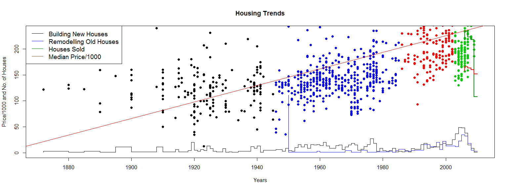
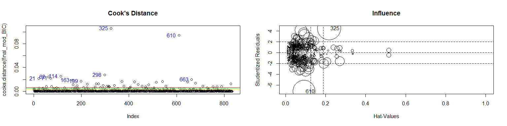
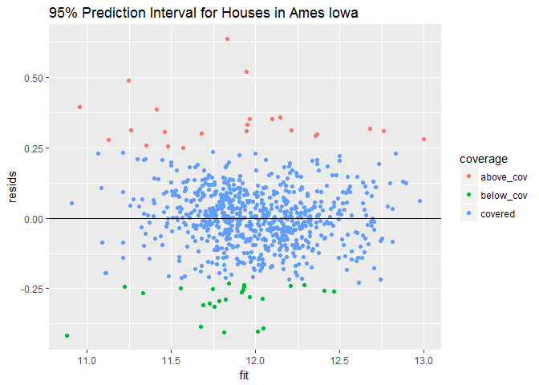

### My Capstone Project in the Statistics with R specialization in Coursera

This repository contains my Capstone project submitted through GitHub for the Capstone course in the [Statistics with R Specialization]("https://www.coursera.org/specializations/statistics").

### Course Description

**About this course:** The capstone project will be an analysis using R that answers a specific scientific/business question provided by the course team. A large and complex dataset will be provided to learners and the analysis will require the application of a variety of methods and techniques introduced in the previous courses, including exploratory data analysis through data visualization and numerical summaries, statistical inference, and modeling as well as interpretations of these results in the context of the data and the research question. The analysis will implement both frequentist and Bayesian techniques and discuss in context of the data how these two approaches are similar and different, and what these differences mean for conclusions that can be drawn from the data. Note: Only learners who have passed the four previous courses in the specialization are eligible to take the Capstone. *from* https://www.coursera.org/learn/statistics-project

### Course Project

For this course project the learner will take the role of a consultant hired by a real estate investment firm in Ames, Iowa, a mid-west town in the United States, to analyze data in order to help provide insight into how the firm should invest for highest profits, and to quantify and communicate to the company management what types of real estate properties are good investments and why. 

They have provided you with data on housing sales from between 2006 to 2010 that contains information about the characteristics of the house (number of bedrooms, number of bathrooms, square footage, etc.) and the house's sale price. The company that hired you has many questions for you about the housing market. It is up to you to decide what methods you want to use (frequentist or Bayesian) to answer these questions, and implement them.

### Sample Plots

### Content 

This Repo contains the following:

- Final_peer.html 
- Final_peer.md 
- Final_peer_files
- A ReadMe markdown document
- index1.png 
- index2.png
- index3.png

The README markdown document is displayed by default by GitHub whenever you visit a GitHub repository. The document you are reading now is the README.md file. It contains information about the content of this repo.

The .png files are the images of the plots that are displayed.

The Final_peer.md is a markdown document which contains my project for this course. You can view the file by clicking on it.

The Final_peer.html document is the html version of the Final_peer.md markdown document. You can view the file by clicking on this link [my capstone project](https://htmlpreview.github.io/?https://github.com/DocOfi/Statistics-with-R/Course5/Final_peer.html).

 

